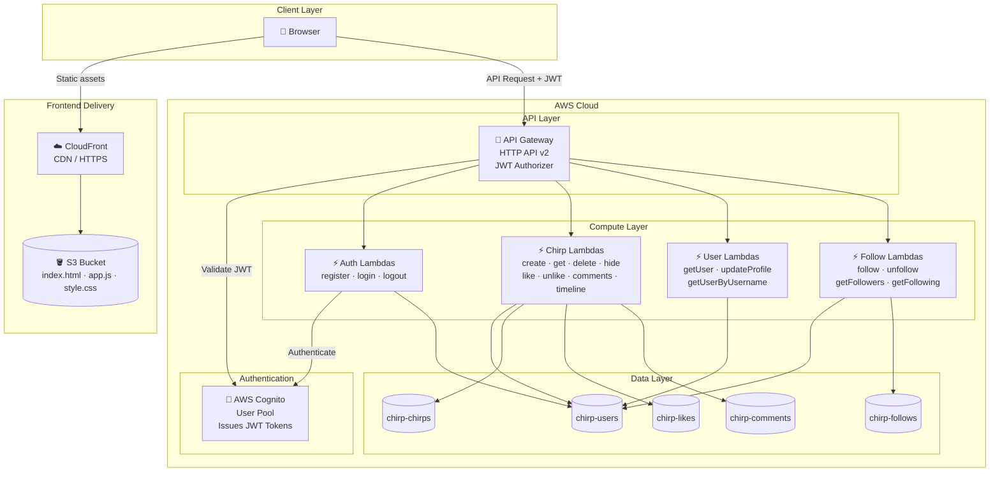

# Chirp - Social Microblogging Platform

> A real-time social microblogging platform built with AWS serverless technologies, similar to Twitter.

[](https://aws.amazon.com/)
[](https://www.typescriptlang.org/)
[](https://nodejs.org/)
[](LICENSE)

## 📋 Table of Contents

- [Overview](#overview)
- [Features](#features)
- [Architecture](#architecture)
- [Technology Stack](#technology-stack)
- [Project Structure](#project-structure)
- [Prerequisites](#prerequisites)
- [Getting Started](#getting-started)
- [Deployment](#deployment)
- [API Endpoints](#api-endpoints)
- [Database Schema](#database-schema)
- [Development](#development)
- [Documentation](#documentation)
- [Contributing](#contributing)

---

## 🎯 Overview

**Chirp** is a cloud-native social microblogging platform that enables users to share short messages (chirps) of up to 280 characters, follow other users, like posts, and engage with comments. Built entirely on AWS serverless technologies, Chirp demonstrates modern cloud architecture patterns with Infrastructure as Code (IaC), API-first design, and scalable data modeling.

### Project Goals

- 🚀 **Scalable**: Serverless architecture that scales automatically with demand
- ⚡ **Low Latency**: Optimized DynamoDB queries and on-demand Lambda execution
- 🔒 **Secure**: JWT-based authentication with AWS Cognito
- 💰 **Cost-Effective**: Pay-per-use pricing — no cost when idle
- 📚 **Well-Documented**: Comprehensive guides for deployment and development

---

## ✨ Features

### Core Functionality

- ✅ **User Authentication**
  - Secure login/logout with AWS Cognito
  - JWT token-based authorization
  - Email-based user registration

- ✅ **Chirp Management**
  - Create chirps (up to 280 characters)
  - Support for media attachments (images/videos)
  - Hide/delete chirps
  - Edit chirps (future enhancement)

- ✅ **Social Interactions**
  - Follow/unfollow users
  - Like/unlike chirps
  - Comment on chirps
  - Personalized timeline (feed)

- ✅ **User Profiles**
  - Custom display names and bios
  - Avatar support
  - Follower/following counts
  - Verified badge system

### Non-Functional Features

- 🔐 **Security**: Rate limiting, input sanitization via Smithy validation, encryption at rest
- ⚡ **Performance**: Optimized DynamoDB queries with GSIs, fast cold starts via esbuild bundling
- 📊 **Monitoring**: CloudFormation outputs, AWS CloudWatch integration ready
- 🔄 **Consistency**: Eventual consistency model (CAP theorem: AP prioritized)

---

## 🏗️ Architecture



### Design Decisions

- **API-First Design**: Using Smithy IDL for API definition ensures type safety and auto-generated documentation
- **NoSQL Database**: DynamoDB chosen for scalability and cost-effectiveness with pay-per-request billing
- **Fan-out on Read**: Timeline algorithm queries followed users on-demand (simpler than fan-out on write)
- **Eventual Consistency**: Prioritizes availability over strong consistency for better performance

---

## 🛠️ Technology Stack

### Infrastructure & Cloud

- **AWS CDK** (TypeScript) - Infrastructure as Code
- **AWS DynamoDB** - NoSQL database (5 tables, 8 GSIs)
- **AWS Lambda** - Serverless compute
- **AWS API Gateway** - REST API management
- **AWS Cognito** - User authentication & authorization
- **AWS CloudFormation** - Resource provisioning

### API & Code Generation

- **Smithy** - API modeling language (v2)
- **Gradle** - Build tool for Smithy compilation
- **OpenAPI** - Generated from Smithy models

### Frontend

- **Vanilla JS + HTML/CSS** - Static frontend (no framework)
- **AWS S3** - Static file hosting
- **AWS CloudFront** - CDN with HTTPS and cache invalidation on deploy

### Development

- **TypeScript 5.9** - Type-safe development
- **Node.js 24.x** - Runtime environment
- **Jest** - Unit testing
- **AWS SDK v3** - AWS service clients

### DevOps

- **GitHub Actions** - CI/CD pipelines (validate + deploy)
- **AWS OIDC** - Keyless authentication from GitHub Actions to AWS
- **CDK CLI** - Infrastructure deployment
- **Git Submodules** - Multi-repo management
- **Git** - Version control

---

## 📁 Project Structure

This project is split across **three repositories** managed via Git Submodules:

| Repository | Description | URL |
|---|---|---|
| **twitter** (this repo) | AWS CDK infrastructure + Lambda handlers | *(this repo)* |
| **Twitter-core** | Smithy API models (submodule → `smithy/`) | [joseluisdaza/Twitter-core](https://github.com/joseluisdaza/Twitter-core) |
| **Twitter-frontend** | Static frontend assets (submodule → `frontend/`) | [joseluisdaza/Twitter-frontend](https://github.com/joseluisdaza/Twitter-frontend) |

```
twitter/                                     # CDK Infrastructure repo (this repo)
├── .gitmodules                              # Submodule configuration
├── smithy/                                  # → submodule: Twitter-core
│   ├── model/                               #   Smithy model files (.smithy)
│   ├── generated/                           #   Generated TypeScript (not in git, run ./gradlew build)
│   ├── build.gradle                         #   Gradle build config
│   └── smithy-build.json                    #   Smithy build config
│
├── frontend/                                # → submodule: Twitter-frontend
│   └── dist/                                #   Static assets (index.html, app.js, style.css)
│
├── infrastructure/                          # AWS CDK Infrastructure
│   ├── bin/infrastructure.ts                # CDK app entry point
│   ├── lib/
│   │   ├── infrastructure-stack.ts          # Main CDK stack
│   │   └── constructs/                      # CDK constructs (Lambdas, API, Frontend, DB)
│   ├── lambda/handlers/                     # Lambda function handlers (TypeScript)
│   ├── scripts/deploy-frontend.mjs          # Frontend deploy + CloudFront invalidation
│   ├── test/                                # CDK stack tests (Jest)
│   └── package.json                         # Node.js dependencies
│
└── docs/                                    # Documentation
    ├── 03_FLUJO_DESARROLLO_Y_ARQUITECTURA.html  # Development workflow guide
    ├── PROYECTO CHIRP.md                    # Technical design document
    └── ...
```

---

## 🔀 Repository Architecture (Git Submodules)

The project uses **Git Submodules** to keep the three repositories independent while allowing the CDK repo to reference exact versions of each.

### How it works

```
twitter/ (CDK repo)
├── smithy/    → pinned to a specific commit of Twitter-core
└── frontend/  → pinned to a specific commit of Twitter-frontend
```

The CDK repo stores a **pointer** (commit SHA) to each submodule. When you clone or checkout, git fetches exactly those commits.

### Working with submodules

```bash
# Clone everything at once
git clone --recurse-submodules <repository-url>

# Already cloned? Initialize submodules
git submodule update --init --recursive

# Pull latest from both submodules
git submodule update --remote --recursive
```

### Making changes to Smithy models or Frontend

Changes to `smithy/` or `frontend/` must be committed in their own repos first, then the pointer in this repo updated:

```bash
# Example: updating the frontend
cd frontend
git add dist/
git commit -m "Description of change"
git push origin main

# Update the pointer in the CDK repo
cd ..
git add frontend
git commit -m "Update frontend submodule"
git push origin main
```

### CI/CD Pipeline

The GitHub Actions workflows use `submodules: recursive` to automatically pull both submodules on every run. Authentication to AWS uses **OIDC** (no stored AWS keys):

| Workflow | Trigger | What it does |
|---|---|---|
| `ci_validate` | Push / PR to `main` | Builds Smithy, runs CDK tests, checks docs |
| `cd_deploy` | Push to `main` | Deploys full stack to AWS via `cdk deploy` |

---

## 📋 Prerequisites

Before you begin, ensure you have the following installed:

- **Node.js** v24.x or higher ([Download](https://nodejs.org/))
- **AWS CLI** v2.x ([Installation Guide](https://docs.aws.amazon.com/cli/latest/userguide/getting-started-install.html))
- **AWS Account** with appropriate permissions
- **Git** for version control
- **Java JDK 21+** (for Smithy/Gradle builds)

### Verification Commands

```bash
# Check Node.js version
node --version
# Expected: v24.x.x

# Check AWS CLI version
aws --version
# Expected: aws-cli/2.x.x

# Check Java version (for Smithy)
java -version
# Expected: Java 11 or higher

# Configure AWS credentials
aws configure
# Enter: Access Key ID, Secret Access Key, Region (us-east-1), Format (json)
```

---

## 🚀 Getting Started

### 1. Clone the Repository

This repository uses **git submodules** for the Smithy models ([Twitter-core](https://github.com/joseluisdaza/Twitter-core)) and the frontend ([Twitter-frontend](https://github.com/joseluisdaza/Twitter-frontend)). You must clone with `--recurse-submodules` to get everything:

```bash
git clone --recurse-submodules <repository-url>
cd twitter
```

If you already cloned without the flag, run this to download the submodules:

```bash
git submodule update --init --recursive
```

To update the submodules to their latest version in the future:

```bash
git submodule update --remote --recursive
```

### 2. Install Dependencies

#### Infrastructure (CDK)

```bash
cd infrastructure
npm install
```

#### Smithy API

```bash
cd ../smithy
npm install
```

### 3. Bootstrap AWS CDK (First Time Only)

```bash
cd infrastructure

# Get your AWS account ID
aws sts get-caller-identity --query Account --output text

# Bootstrap CDK (replace ACCOUNT-ID with your actual account ID)
npx cdk bootstrap aws://ACCOUNT-ID/us-east-1
```

### 4. Build Smithy Models

```bash
cd smithy
./gradlew build

# On Windows:
# gradlew.bat build
```

### 5. Deploy Infrastructure

```bash
cd infrastructure

# Compile TypeScript
npm run build

# Preview changes (optional)
npx cdk diff

# Deploy DynamoDB tables
npx cdk deploy
```

### 6. Seed Test Data (Optional)

```bash
cd infrastructure
node test-data-seeder.js
```

This creates:

- 3 test users (Juan, María, Carlos)
- 5 sample chirps
- 5 follow relationships
- 4 likes
- 3 comments

---

## 📦 Deployment

### Full Deployment Guide

For detailed step-by-step deployment instructions, see:

- 📖 [Infrastructure Deployment Guide](infrastructure/DEPLOYMENT_GUIDE.md)
- 📖 [API Deployment Guide](docs/02_API_Smithy_Lambda_Cognito.md)

### Quick Deploy Commands

```bash
# Build Smithy models (generates TypeScript types)
cd smithy
./gradlew build

# Deploy full infrastructure (DynamoDB, Lambda, API Gateway, Cognito, CloudFront)
cd infrastructure
npm run build
npx cdk deploy

# Deploy frontend to S3 + invalidate CloudFront cache
node scripts/deploy-frontend.mjs
```

### Deployment Checklist

- [ ] AWS credentials configured (`aws configure`)
- [ ] CDK bootstrapped for your account (`npx cdk bootstrap`)
- [ ] Smithy models compiled (`./gradlew build`)
- [ ] Infrastructure deployed (`npx cdk deploy`)
- [ ] Frontend deployed (`node scripts/deploy-frontend.mjs`)

---

## 🔌 API Endpoints

### Current Status: ✅ Deployed

All endpoints are implemented with AWS Lambda + API Gateway and live in production.

#### Authentication

| Endpoint           | Method | Description     | Auth Required |
| ------------------ | ------ | --------------- | ------------- |
| `/auth/register`   | POST   | Register user   | ❌ No         |
| `/auth/login`      | POST   | User login      | ❌ No         |
| `/auth/logout`     | POST   | User logout     | ✅ Yes        |

#### Chirps

| Endpoint                    | Method | Description          | Auth Required  |
| --------------------------- | ------ | -------------------- | -------------- |
| `/chirps`                   | POST   | Create a chirp       | ✅ Yes         |
| `/chirps/{id}`              | GET    | Get chirp details    | ✅ Yes         |
| `/chirps/{id}`              | DELETE | Delete a chirp       | ✅ Yes (owner) |
| `/chirps/{id}/hide`         | POST   | Hide/show a chirp    | ✅ Yes (owner) |
| `/chirps/{id}/like`         | POST   | Like a chirp         | ✅ Yes         |
| `/chirps/{id}/like`         | DELETE | Unlike a chirp       | ✅ Yes         |
| `/chirps/{id}/likes`        | GET    | Get chirp likes      | ✅ Yes         |
| `/chirps/{id}/comments`     | GET    | Get chirp comments   | ✅ Yes         |
| `/chirps/{id}/comments`     | POST   | Add a comment        | ✅ Yes         |
| `/chirps/{id}/comments/{c}` | DELETE | Delete a comment     | ✅ Yes (owner) |
| `/timeline`                 | GET    | Personalized feed    | ✅ Yes         |

#### Users & Social

| Endpoint                      | Method | Description              | Auth Required |
| ----------------------------- | ------ | ------------------------ | ------------- |
| `/users/{id}`                 | GET    | Get user by ID           | ✅ Yes        |
| `/users/{id}`                 | PUT    | Update user profile      | ✅ Yes (own)  |
| `/users/by-username/{u}`      | GET    | Get user by username     | ✅ Yes        |
| `/users/{id}/chirps`          | GET    | Get user's chirps        | ✅ Yes        |
| `/users/{id}/likes`           | GET    | Get user's liked chirps  | ✅ Yes        |
| `/users/{id}/follow`          | POST   | Follow a user            | ✅ Yes        |
| `/users/{id}/follow`          | DELETE | Unfollow a user          | ✅ Yes        |
| `/users/{id}/followers`       | GET    | Get user's followers     | ✅ Yes        |
| `/users/{id}/following`       | GET    | Get users followed       | ✅ Yes        |

### Example Request (Login)

```bash
curl -X POST https://api.chirp.com/auth/login \
  -H "Content-Type: application/json" \
  -d '{
    "email": "user@example.com",
    "password": "SecurePass123"
  }'
```

### Example Response

```json
{
  "accessToken": "eyJhbGc...",
  "idToken": "eyJhbGc...",
  "refreshToken": "eyJhbGc...",
  "expiresIn": 3600,
  "tokenType": "Bearer"
}
```

For complete API documentation, see: [Smithy Models](smithy/model/)

---

## 🗄️ Database Schema

### DynamoDB Tables

#### 1. **chirp-users** - User Data

| Attribute      | Type    | Description              |
| -------------- | ------- | ------------------------ |
| userId (PK)    | String  | UUID                     |
| username       | String  | Unique @username         |
| email          | String  | User email               |
| displayName    | String  | Display name             |
| bio            | String  | User bio (max 160 chars) |
| avatarUrl      | String  | Profile picture URL      |
| followersCount | Number  | Count of followers       |
| followingCount | Number  | Count of following       |
| verified       | Boolean | Verified badge           |
| createdAt      | String  | ISO 8601 timestamp       |

**GSI:**

- `username-index` - Search by @username
- `email-index` - Search by email

---

#### 2. **chirp-chirps** - Posts

| Attribute     | Type   | Description               |
| ------------- | ------ | ------------------------- |
| chirpId (PK)  | String | UUID                      |
| userId        | String | Author's userId           |
| username      | String | Author's @username        |
| content       | String | Chirp text (max 280 char) |
| mediaUrls     | List   | Array of media URLs       |
| likesCount    | Number | Count of likes            |
| commentsCount | Number | Count of comments         |
| createdAt     | String | ISO 8601 timestamp        |

**GSI:**

- `userId-createdAt-index` - Get user's chirps sorted by date ⭐

---

#### 3. **chirp-follows** - Follow Relationships

| Attribute       | Type   | Description         |
| --------------- | ------ | ------------------- |
| followerId (PK) | String | User who follows    |
| followedId (SK) | String | User being followed |
| createdAt       | String | ISO 8601 timestamp  |

**GSI:**

- `followedId-followerId-index` - Get followers of a user

---

#### 4. **chirp-likes** - Like Interactions

| Attribute    | Type   | Description        |
| ------------ | ------ | ------------------ |
| chirpId (PK) | String | Chirp being liked  |
| userId (SK)  | String | User who liked     |
| username     | String | User's @username   |
| createdAt    | String | ISO 8601 timestamp |

**GSI:**

- `userId-chirpId-index` - Get chirps liked by user

---

#### 5. **chirp-comments** - Comments

| Attribute      | Type   | Description           |
| -------------- | ------ | --------------------- |
| commentId (PK) | String | UUID                  |
| chirpId        | String | Parent chirp ID       |
| userId         | String | Commenter's userId    |
| username       | String | Commenter's @username |
| content        | String | Comment text          |
| likesCount     | Number | Count of likes        |
| createdAt      | String | ISO 8601 timestamp    |

**GSI:**

- `chirpId-createdAt-index` - Get comments for a chirp ⭐
- `userId-createdAt-index` - Get user's comments

---

### Entity Relationship Diagram

```mermaid
erDiagram
    USERS ||--o{ CHIRPS : "creates"
    USERS ||--o{ FOLLOWS : "follows"
    USERS ||--o{ FOLLOWS : "is_followed_by"
    USERS ||--o{ LIKES : "likes"
    CHIRPS ||--o{ LIKES : "receives_likes"
    CHIRPS ||--o{ COMMENTS : "has_comments"
    USERS ||--o{ COMMENTS : "writes"

    USERS {
        string userId PK
        string username
        string email
        string displayName
        number followersCount
        number followingCount
    }

    CHIRPS {
        string chirpId PK
        string userId FK
        string content
        list mediaUrls
        number likesCount
        number commentsCount
    }

    FOLLOWS {
        string followerId PK
        string followedId SK
    }

    LIKES {
        string chirpId PK
        string userId SK
    }

    COMMENTS {
        string commentId PK
        string chirpId FK
        string userId FK
        string content
    }
```

For detailed database design, see: [DynamoDB Design Document](infrastructure/DYNAMODB_DESIGN.md)

---

## 💻 Development

### Project Setup

```bash
# Install all dependencies
npm install

# Compile TypeScript (infrastructure)
cd infrastructure
npm run build

# Watch mode (auto-compile)
npm run watch

# Run tests
npm test

# Build Smithy models
cd ../smithy
./gradlew build
```

### Code Structure

- **Infrastructure Code**: [infrastructure/lib/](infrastructure/lib/) — CDK stack and constructs
- **Lambda Handlers**: [infrastructure/lambda/handlers/](infrastructure/lambda/handlers/) — one file per endpoint
- **Smithy Models**: [smithy/model/](smithy/model/) — API definition (Twitter-core submodule)
- **Frontend**: [frontend/dist/](frontend/dist/) — static assets (Twitter-frontend submodule)

### Testing

```bash
# Run infrastructure tests
cd infrastructure
npm test

# Test DynamoDB queries
node test-data-seeder.js
```

### Environment Variables

Create a `.env` file (not committed) with:

```env
AWS_REGION=us-east-1
AWS_ACCOUNT_ID=123456789012
COGNITO_USER_POOL_ID=us-east-1_xxxxxxxxx
API_GATEWAY_URL=https://xxxxxx.execute-api.us-east-1.amazonaws.com
```

---

## 📚 Documentation

### Core Documentation

- 📘 [Technical Design Document](docs/PROYECTO%20CHIRP.md) - Complete system design
- 📗 [Infrastructure Deployment Guide](infrastructure/DEPLOYMENT_GUIDE.md) - Step-by-step deployment
- 📕 [DynamoDB Design](infrastructure/DYNAMODB_DESIGN.md) - Database schema and queries
- 📙 [API Implementation Guide](docs/02_API_Smithy_Lambda_Cognito.md) - Smithy + Lambda setup
- 📖 [AWS CLI Commands](docs/01_Comandos_AWS_Base_Datos.md) - Useful AWS commands

### Additional Resources

- [Work Plan](docs/PlanDeTrabajo.md) - Project roadmap
- [Phase 1 Rubric](docs/Rubrica_Parte1.md) - Assessment criteria
- [Implementation Summary](infrastructure/IMPLEMENTATION_SUMMARY.md) - What's completed

### External Documentation

- [AWS CDK Documentation](https://docs.aws.amazon.com/cdk/)
- [Smithy Documentation](https://smithy.io/2.0/)
- [DynamoDB Best Practices](https://docs.aws.amazon.com/amazondynamodb/latest/developerguide/best-practices.html)

---

## 🧪 Testing Strategy

### Unit Tests

- Jest for TypeScript/Node.js code
- CDK assertions for infrastructure validation

### Integration Tests

- AWS SDK queries against deployed DynamoDB tables
- Seed data script validates table creation

### Load Testing (Future)

- Sustained load testing with realistic user simulation
- Timeline latency benchmarking under concurrent requests
- Stress testing DynamoDB GSI query performance

---

## 📊 Cost Estimation

### Cost Model

All services use **pay-per-use** pricing — the cost scales directly with usage and is effectively $0 when idle.

| Service              | Billing Model         | Free Tier                          |
| -------------------- | --------------------- | ---------------------------------- |
| DynamoDB (On-Demand) | Per read/write        | 25 GB storage, 200M requests/month |
| Lambda               | Per invocation + time | 1M invocations/month               |
| API Gateway          | Per request           | 1M requests/month                  |
| Cognito              | Per MAU               | 50,000 MAU/month                   |
| CloudFront + S3      | Per GB transferred    | 1 TB transfer/month                |
| CloudWatch Logs      | Per GB ingested       | 5 GB ingestion/month               |

> For accurate cost estimates based on your actual usage, use the [AWS Pricing Calculator](https://calculator.aws/).

---

## 🗺️ Roadmap

### ✅ Phase 1: Foundation (COMPLETED)

- [x] DynamoDB tables design and deployment
- [x] Infrastructure as Code (AWS CDK)
- [x] Smithy API model definition
- [x] Test data seeding script
- [x] Comprehensive documentation

### ✅ Phase 2: API & Authentication (COMPLETED)

- [x] AWS Cognito User Pool setup
- [x] Lambda functions for all endpoints (23 handlers)
- [x] API Gateway configuration
- [x] JWT token validation
- [x] CI/CD pipeline (GitHub Actions + AWS OIDC)
- [x] Multi-repo architecture (Git Submodules)

### ✅ Phase 3: Frontend (COMPLETED)

- [x] Static frontend (HTML/CSS/JS) deployed to S3 + CloudFront
- [x] Authentication (register, login, logout)
- [x] Timeline with refresh button
- [x] Chirp creation, deletion, hiding, likes
- [x] Comments with user name resolution
- [x] User profiles and search
- [x] Follow/unfollow users

### 📅 Phase 4: Advanced Features (PLANNED)

- [ ] Real-time updates (WebSockets / SSE)
- [ ] Media upload (S3 integration)
- [ ] Notifications system
- [ ] Trending topics algorithm
- [ ] Direct messaging

---

## 🤝 Contributing

Contributions are welcome! This is an educational project for learning AWS and serverless architectures.

### How to Contribute

1. Fork the repository
2. Create a feature branch (`git checkout -b feature/amazing-feature`)
3. Commit your changes (`git commit -m 'Add amazing feature'`)
4. Push to the branch (`git push origin feature/amazing-feature`)
5. Open a Pull Request

### Coding Standards

- Follow TypeScript best practices
- Use meaningful variable/function names
- Add comments for complex logic
- Write tests for new features
- Update documentation

---

## 📄 License

This project is licensed under the MIT License - see the [LICENSE](LICENSE) file for details.

---

## 👤 Author

**Full Stack Master's Program Project**  
Artificial Intelligence Module  
April 2026

---

## 🙏 Acknowledgments

- AWS for serverless technologies
- Smithy team for excellent IDL tooling
- CDK for Infrastructure as Code
- The open-source community

---

## 📞 Support

For questions or issues:

1. Check the [Documentation](#documentation)
2. Review existing [Issues](../../issues)
3. Open a new issue with detailed description


