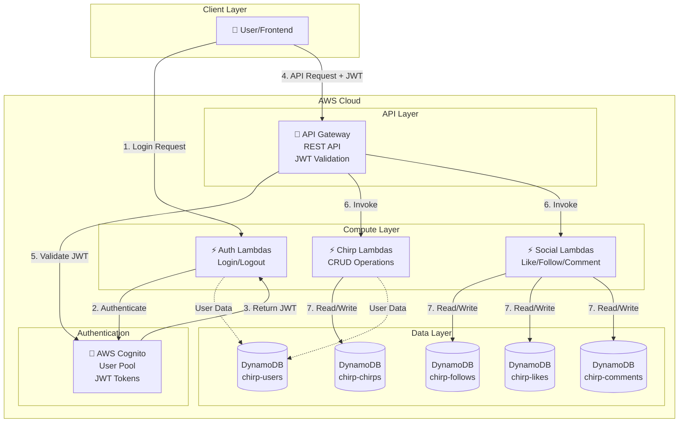

# Chirp - Social Microblogging Platform

> A real-time social microblogging platform built with AWS serverless technologies, similar to Twitter.

[](https://aws.amazon.com/)
[](https://www.typescriptlang.org/)
[](https://nodejs.org/)
[](LICENSE)

## 📋 Table of Contents

- [Overview](#overview)
- [Features](#features)
- [Architecture](#architecture)
- [Technology Stack](#technology-stack)
- [Project Structure](#project-structure)
- [Prerequisites](#prerequisites)
- [Getting Started](#getting-started)
- [Deployment](#deployment)
- [API Endpoints](#api-endpoints)
- [Database Schema](#database-schema)
- [Development](#development)
- [Documentation](#documentation)
- [Contributing](#contributing)

---

## 🎯 Overview

**Chirp** is a cloud-native social microblogging platform that enables users to share short messages (chirps) of up to 280 characters, follow other users, like posts, and engage with comments. Built entirely on AWS serverless technologies, Chirp demonstrates modern cloud architecture patterns with Infrastructure as Code (IaC), API-first design, and scalable data modeling.

### Project Goals

- 🚀 **Scalable**: Handle up to 100 QPS with potential for thousands of daily active users
- ⚡ **Low Latency**: Timeline generation < 400ms at p95
- 🔒 **Secure**: JWT-based authentication with AWS Cognito
- 💰 **Cost-Effective**: Serverless architecture with pay-per-use pricing
- 📚 **Well-Documented**: Comprehensive guides for deployment and development

---

## ✨ Features

### Core Functionality

- ✅ **User Authentication**
  - Secure login/logout with AWS Cognito
  - JWT token-based authorization
  - Email-based user registration

- ✅ **Chirp Management**
  - Create chirps (up to 280 characters)
  - Support for media attachments (images/videos)
  - Hide/delete chirps
  - Edit chirps (future enhancement)

- ✅ **Social Interactions**
  - Follow/unfollow users
  - Like/unlike chirps
  - Comment on chirps
  - Personalized timeline (feed)

- ✅ **User Profiles**
  - Custom display names and bios
  - Avatar support
  - Follower/following counts
  - Verified badge system

### Non-Functional Features

- 🔐 **Security**: Rate limiting (30 chirps/hour), input sanitization, encryption at rest
- ⚡ **Performance**: 99.9% uptime SLA, optimized DynamoDB queries with GSIs
- 📊 **Monitoring**: CloudFormation outputs, AWS CloudWatch integration ready
- 🔄 **Consistency**: Eventual consistency model (CAP theorem: AP prioritized)

---

## 🏗️ Architecture



### Design Decisions

- **API-First Design**: Using Smithy IDL for API definition ensures type safety and auto-generated documentation
- **NoSQL Database**: DynamoDB chosen for scalability and cost-effectiveness with pay-per-request billing
- **Fan-out on Read**: Timeline algorithm queries followed users on-demand (simpler than fan-out on write)
- **Eventual Consistency**: Prioritizes availability over strong consistency for better performance

---

## 🛠️ Technology Stack

### Infrastructure & Cloud

- **AWS CDK** (TypeScript) - Infrastructure as Code
- **AWS DynamoDB** - NoSQL database (5 tables, 8 GSIs)
- **AWS Lambda** - Serverless compute
- **AWS API Gateway** - REST API management
- **AWS Cognito** - User authentication & authorization
- **AWS CloudFormation** - Resource provisioning

### API & Code Generation

- **Smithy** - API modeling language (v2)
- **Gradle** - Build tool for Smithy compilation
- **OpenAPI** - Generated from Smithy models

### Development

- **TypeScript 5.9** - Type-safe development
- **Node.js 20.x** - Runtime environment
- **Jest** - Unit testing
- **AWS SDK v3** - AWS service clients

### DevOps

- **AWS CLI v2** - Command-line deployment
- **CDK CLI** - Infrastructure deployment
- **Git** - Version control

---

## 📁 Project Structure

```
twitter/
├── docs/                                    # Documentation
│   ├── 01_Comandos_AWS_Base_Datos.md       # AWS CLI commands guide
│   ├── 02_API_Smithy_Lambda_Cognito.md     # API implementation guide
│   ├── PlanDeTrabajo.md                     # Work plan
│   ├── PROYECTO CHIRP.md                    # Technical design document
│   └── Rubrica_Parte1.md                    # Phase 1 rubric
│
├── infrastructure/                          # AWS CDK Infrastructure
│   ├── bin/
│   │   └── infrastructure.ts                # CDK app entry point
│   ├── lib/
│   │   └── infrastructure-stack.ts          # DynamoDB tables definition
│   ├── test/
│   │   └── infrastructure.test.ts           # CDK stack tests
│   ├── cdk.json                             # CDK configuration
│   ├── package.json                         # Node.js dependencies
│   ├── test-data-seeder.js                  # Database seeding script
│   ├── DEPLOYMENT_GUIDE.md                  # Step-by-step deployment
│   ├── DYNAMODB_DESIGN.md                   # Database design document
│   └── README.md                            # Infrastructure overview
│
└── smithy/                                  # Smithy API Models
    ├── model/                               # Smithy model files
    │   ├── main.smithy                      # Main service definition
    │   ├── auth.smithy                      # Authentication operations
    │   ├── chirps.smithy                    # Chirp CRUD operations
    │   └── common.smithy                    # Shared types & errors
    ├── build.gradle                         # Gradle build config
    ├── smithy-build.json                    # Smithy build config
    └── package.json                         # Smithy dependencies
```

---

## 📋 Prerequisites

Before you begin, ensure you have the following installed:

- **Node.js** v20.x or higher ([Download](https://nodejs.org/))
- **AWS CLI** v2.x ([Installation Guide](https://docs.aws.amazon.com/cli/latest/userguide/getting-started-install.html))
- **AWS Account** with appropriate permissions
- **Git** for version control
- **Java JDK 11+** (for Smithy/Gradle builds)

### Verification Commands

```bash
# Check Node.js version
node --version
# Expected: v20.x.x

# Check AWS CLI version
aws --version
# Expected: aws-cli/2.x.x

# Check Java version (for Smithy)
java -version
# Expected: Java 11 or higher

# Configure AWS credentials
aws configure
# Enter: Access Key ID, Secret Access Key, Region (us-east-1), Format (json)
```

---

## 🚀 Getting Started

### 1. Clone the Repository

```bash
git clone <repository-url>
cd twitter
```

### 2. Install Dependencies

#### Infrastructure (CDK)

```bash
cd infrastructure
npm install
```

#### Smithy API

```bash
cd ../smithy
npm install
```

### 3. Bootstrap AWS CDK (First Time Only)

```bash
cd infrastructure

# Get your AWS account ID
aws sts get-caller-identity --query Account --output text

# Bootstrap CDK (replace ACCOUNT-ID with your actual account ID)
npx cdk bootstrap aws://ACCOUNT-ID/us-east-1
```

### 4. Build Smithy Models

```bash
cd smithy
./gradlew build

# On Windows:
# gradlew.bat build
```

### 5. Deploy Infrastructure

```bash
cd infrastructure

# Compile TypeScript
npm run build

# Preview changes (optional)
npx cdk diff

# Deploy DynamoDB tables
npx cdk deploy
```

### 6. Seed Test Data (Optional)

```bash
cd infrastructure
node test-data-seeder.js
```

This creates:

- 3 test users (Juan, María, Carlos)
- 5 sample chirps
- 5 follow relationships
- 4 likes
- 3 comments

---

## 📦 Deployment

### Full Deployment Guide

For detailed step-by-step deployment instructions, see:

- 📖 [Infrastructure Deployment Guide](infrastructure/DEPLOYMENT_GUIDE.md)
- 📖 [API Deployment Guide](docs/02_API_Smithy_Lambda_Cognito.md)

### Quick Deploy Commands

```bash
# Deploy DynamoDB infrastructure
cd infrastructure
npm run build
npx cdk deploy

# Build Smithy API models
cd ../smithy
./gradlew build

# Deploy Lambda functions (coming soon)
# cd ../lambda
# npm run deploy
```

### Deployment Checklist

- [ ] AWS credentials configured (`aws configure`)
- [ ] CDK bootstrapped for your account
- [ ] Infrastructure deployed (`cdk deploy`)
- [ ] Smithy models compiled (`gradlew build`)
- [ ] Lambda functions deployed (Phase 2)
- [ ] API Gateway configured (Phase 2)
- [ ] Cognito User Pool created (Phase 2)

---

## 🔌 API Endpoints

### Current Status: Phase 1 (In Progress)

The API is defined using Smithy and will be implemented with AWS Lambda + API Gateway.

### Planned Endpoints

#### Authentication

| Endpoint       | Method | Description | Auth Required |
| -------------- | ------ | ----------- | ------------- |
| `/auth/login`  | POST   | User login  | ❌ No         |
| `/auth/logout` | POST   | User logout | ✅ Yes        |

#### Chirps

| Endpoint            | Method | Description       | Auth Required  |
| ------------------- | ------ | ----------------- | -------------- |
| `/chirps`           | POST   | Create a chirp    | ✅ Yes         |
| `/chirps/{id}`      | GET    | Get chirp details | ❌ No          |
| `/chirps/{id}/like` | POST   | Like a chirp      | ✅ Yes         |
| `/chirps/{id}/like` | DELETE | Unlike a chirp    | ✅ Yes         |
| `/chirps/{id}/hide` | POST   | Hide a chirp      | ✅ Yes (owner) |

#### Users & Social

| Endpoint                   | Method | Description           | Auth Required |
| -------------------------- | ------ | --------------------- | ------------- |
| `/users/{username}`        | GET    | Get user profile      | ❌ No         |
| `/users/{username}/follow` | POST   | Follow a user         | ✅ Yes        |
| `/timeline`                | GET    | Get personalized feed | ✅ Yes        |

### Example Request (Login)

```bash
curl -X POST https://api.chirp.com/auth/login \
  -H "Content-Type: application/json" \
  -d '{
    "email": "user@example.com",
    "password": "SecurePass123"
  }'
```

### Example Response

```json
{
  "accessToken": "eyJhbGc...",
  "idToken": "eyJhbGc...",
  "refreshToken": "eyJhbGc...",
  "expiresIn": 3600,
  "tokenType": "Bearer"
}
```

For complete API documentation, see: [Smithy Models](smithy/model/)

---

## 🗄️ Database Schema

### DynamoDB Tables

#### 1. **chirp-users** - User Data

| Attribute      | Type    | Description              |
| -------------- | ------- | ------------------------ |
| userId (PK)    | String  | UUID                     |
| username       | String  | Unique @username         |
| email          | String  | User email               |
| displayName    | String  | Display name             |
| bio            | String  | User bio (max 160 chars) |
| avatarUrl      | String  | Profile picture URL      |
| followersCount | Number  | Count of followers       |
| followingCount | Number  | Count of following       |
| verified       | Boolean | Verified badge           |
| createdAt      | String  | ISO 8601 timestamp       |

**GSI:**

- `username-index` - Search by @username
- `email-index` - Search by email

---

#### 2. **chirp-chirps** - Posts

| Attribute     | Type   | Description               |
| ------------- | ------ | ------------------------- |
| chirpId (PK)  | String | UUID                      |
| userId        | String | Author's userId           |
| username      | String | Author's @username        |
| content       | String | Chirp text (max 280 char) |
| mediaUrls     | List   | Array of media URLs       |
| likesCount    | Number | Count of likes            |
| commentsCount | Number | Count of comments         |
| createdAt     | String | ISO 8601 timestamp        |

**GSI:**

- `userId-createdAt-index` - Get user's chirps sorted by date ⭐

---

#### 3. **chirp-follows** - Follow Relationships

| Attribute       | Type   | Description         |
| --------------- | ------ | ------------------- |
| followerId (PK) | String | User who follows    |
| followedId (SK) | String | User being followed |
| createdAt       | String | ISO 8601 timestamp  |

**GSI:**

- `followedId-followerId-index` - Get followers of a user

---

#### 4. **chirp-likes** - Like Interactions

| Attribute    | Type   | Description        |
| ------------ | ------ | ------------------ |
| chirpId (PK) | String | Chirp being liked  |
| userId (SK)  | String | User who liked     |
| username     | String | User's @username   |
| createdAt    | String | ISO 8601 timestamp |

**GSI:**

- `userId-chirpId-index` - Get chirps liked by user

---

#### 5. **chirp-comments** - Comments

| Attribute      | Type   | Description           |
| -------------- | ------ | --------------------- |
| commentId (PK) | String | UUID                  |
| chirpId        | String | Parent chirp ID       |
| userId         | String | Commenter's userId    |
| username       | String | Commenter's @username |
| content        | String | Comment text          |
| likesCount     | Number | Count of likes        |
| createdAt      | String | ISO 8601 timestamp    |

**GSI:**

- `chirpId-createdAt-index` - Get comments for a chirp ⭐
- `userId-createdAt-index` - Get user's comments

---

### Entity Relationship Diagram

```mermaid
erDiagram
    USERS ||--o{ CHIRPS : "creates"
    USERS ||--o{ FOLLOWS : "follows"
    USERS ||--o{ FOLLOWS : "is_followed_by"
    USERS ||--o{ LIKES : "likes"
    CHIRPS ||--o{ LIKES : "receives_likes"
    CHIRPS ||--o{ COMMENTS : "has_comments"
    USERS ||--o{ COMMENTS : "writes"

    USERS {
        string userId PK
        string username
        string email
        string displayName
        number followersCount
        number followingCount
    }

    CHIRPS {
        string chirpId PK
        string userId FK
        string content
        list mediaUrls
        number likesCount
        number commentsCount
    }

    FOLLOWS {
        string followerId PK
        string followedId SK
    }

    LIKES {
        string chirpId PK
        string userId SK
    }

    COMMENTS {
        string commentId PK
        string chirpId FK
        string userId FK
        string content
    }
```

For detailed database design, see: [DynamoDB Design Document](infrastructure/DYNAMODB_DESIGN.md)

---

## 💻 Development

### Project Setup

```bash
# Install all dependencies
npm install

# Compile TypeScript (infrastructure)
cd infrastructure
npm run build

# Watch mode (auto-compile)
npm run watch

# Run tests
npm test

# Build Smithy models
cd ../smithy
./gradlew build
```

### Code Structure

- **Infrastructure Code**: [infrastructure/lib/infrastructure-stack.ts](infrastructure/lib/infrastructure-stack.ts)
- **Smithy Models**: [smithy/model/](smithy/model/)
- **Lambda Functions**: Coming in Phase 2

### Testing

```bash
# Run infrastructure tests
cd infrastructure
npm test

# Test DynamoDB queries
node test-data-seeder.js
```

### Environment Variables

Create a `.env` file (not committed) with:

```env
AWS_REGION=us-east-1
AWS_ACCOUNT_ID=123456789012
COGNITO_USER_POOL_ID=us-east-1_xxxxxxxxx
API_GATEWAY_URL=https://xxxxxx.execute-api.us-east-1.amazonaws.com
```

---

## 📚 Documentation

### Core Documentation

- 📘 [Technical Design Document](docs/PROYECTO%20CHIRP.md) - Complete system design
- 📗 [Infrastructure Deployment Guide](infrastructure/DEPLOYMENT_GUIDE.md) - Step-by-step deployment
- 📕 [DynamoDB Design](infrastructure/DYNAMODB_DESIGN.md) - Database schema and queries
- 📙 [API Implementation Guide](docs/02_API_Smithy_Lambda_Cognito.md) - Smithy + Lambda setup
- 📖 [AWS CLI Commands](docs/01_Comandos_AWS_Base_Datos.md) - Useful AWS commands

### Additional Resources

- [Work Plan](docs/PlanDeTrabajo.md) - Project roadmap
- [Phase 1 Rubric](docs/Rubrica_Parte1.md) - Assessment criteria
- [Implementation Summary](infrastructure/IMPLEMENTATION_SUMMARY.md) - What's completed

### External Documentation

- [AWS CDK Documentation](https://docs.aws.amazon.com/cdk/)
- [Smithy Documentation](https://smithy.io/2.0/)
- [DynamoDB Best Practices](https://docs.aws.amazon.com/amazondynamodb/latest/developerguide/best-practices.html)

---

## 🧪 Testing Strategy

### Unit Tests

- Jest for TypeScript/Node.js code
- CDK assertions for infrastructure validation

### Integration Tests

- AWS SDK queries against deployed DynamoDB tables
- Seed data script validates table creation

### Load Testing (Future)

- Target: 100 QPS sustained
- Timeline latency < 400ms at p95
- 500-1000 DAU simulation

---

## 📊 Cost Estimation

### Monthly Cost Breakdown (500 DAU)

| Service              | Usage                       | Cost             |
| -------------------- | --------------------------- | ---------------- |
| DynamoDB (On-Demand) | ~10,000 reads, 1,000 writes | $0.50            |
| Lambda               | 50,000 invocations          | $0.10            |
| API Gateway          | 50,000 requests             | $0.05            |
| Cognito              | 500 MAU                     | FREE             |
| CloudWatch Logs      | 1 GB logs                   | $0.50            |
| Data Transfer        | 5 GB outbound               | $0.45            |
| **TOTAL**            | -                           | **~$1.60/month** |

> AWS Free Tier covers most development usage for the first 12 months

---

## 🗺️ Roadmap

### ✅ Phase 1: Foundation (COMPLETED)

- [x] DynamoDB tables design and deployment
- [x] Infrastructure as Code (AWS CDK)
- [x] Smithy API model definition
- [x] Test data seeding script
- [x] Comprehensive documentation

### 🚧 Phase 2: API & Authentication (IN PROGRESS)

- [ ] AWS Cognito User Pool setup
- [ ] Lambda functions for all endpoints
- [ ] API Gateway configuration
- [ ] JWT token validation
- [ ] Rate limiting implementation

### 📅 Phase 3: Frontend & Features (PLANNED)

- [ ] React/Next.js frontend
- [ ] Real-time timeline updates (WebSockets)
- [ ] Media upload (S3 integration)
- [ ] Search functionality
- [ ] Notifications system

### 🔮 Phase 4: Advanced Features (FUTURE - NICE TO HAVE)

- [ ] Elasticsearch for full-text search
- [ ] Trending topics algorithm
- [ ] Direct messaging
- [ ] Content moderation
- [ ] Analytics dashboard

---

## 🤝 Contributing

Contributions are welcome! This is an educational project for learning AWS and serverless architectures.

### How to Contribute

1. Fork the repository
2. Create a feature branch (`git checkout -b feature/amazing-feature`)
3. Commit your changes (`git commit -m 'Add amazing feature'`)
4. Push to the branch (`git push origin feature/amazing-feature`)
5. Open a Pull Request

### Coding Standards

- Follow TypeScript best practices
- Use meaningful variable/function names
- Add comments for complex logic
- Write tests for new features
- Update documentation

---

## 📄 License

This project is licensed under the MIT License - see the [LICENSE](LICENSE) file for details.

---

## 👤 Author

**Full Stack Master's Program Project**  
Artificial Intelligence Module  
April 2026

---

## 🙏 Acknowledgments

- AWS for serverless technologies
- Smithy team for excellent IDL tooling
- CDK for Infrastructure as Code
- The open-source community

---

## 📞 Support

For questions or issues:

1. Check the [Documentation](#documentation)
2. Review existing [Issues](../../issues)
3. Open a new issue with detailed description

---

## ⭐ Star History

If you find this project useful, please consider giving it a star! ⭐

---

**Built with ❤️ using AWS Serverless Technologies**
