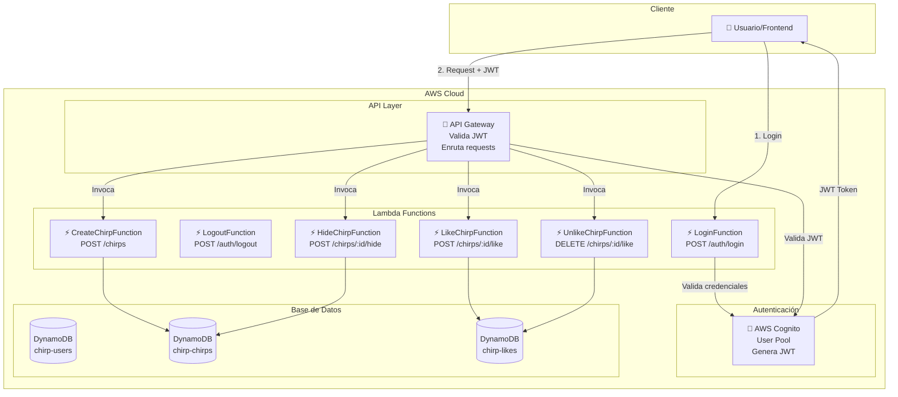

# 🔐 API con Smithy + Lambda + Cognito - Proyecto Chirp

**Estado:** 🚧 En Progreso  
**Fase Actual:** Fase 1 - Configuración de Smithy  
**Última actualización:** Abril 4, 2026

---

## 📚 Índice

1. [Introducción](#introducción)
2. [¿Qué es Smithy?](#qué-es-smithy)
3. [Arquitectura de la Solución](#arquitectura-de-la-solución)
4. [Fase 1: Configuración de Smithy](#fase-1-configuración-de-smithy)
5. [Fase 2: Modelos Smithy para los Endpoints](#fase-2-modelos-smithy-para-los-endpoints)
6. [Fase 3: AWS Cognito (AuthN)](#fase-3-aws-cognito-authn)
7. [Fase 4: Lambda Functions](#fase-4-lambda-functions)
8. [Fase 5: API Gateway](#fase-5-api-gateway)
9. [Fase 6: Autorización (AuthZ)](#fase-6-autorización-authz)
10. [Testing](#testing)
11. [Troubleshooting](#troubleshooting)

---

## Introducción

Vamos a implementar estos **5 endpoints**:

| Endpoint            | Método | Descripción             | Autenticación         |
| ------------------- | ------ | ----------------------- | --------------------- |
| `/auth/login`       | POST   | Iniciar sesión          | ❌ No (público)       |
| `/auth/logout`      | POST   | Cerrar sesión           | ✅ Sí                 |
| `/chirps`           | POST   | Crear un chirp          | ✅ Sí                 |
| `/chirps/{id}/like` | POST   | Dar like a un chirp     | ✅ Sí                 |
| `/chirps/{id}/like` | DELETE | Quitar like de un chirp | ✅ Sí                 |
| `/chirps/{id}/hide` | POST   | Ocultar un chirp        | ✅ Sí (solo el autor) |

---

## ¿Qué es Smithy?

**Smithy** es un lenguaje de definición de interfaces (IDL) creado por AWS para definir APIs de forma clara y generar código automáticamente.

### 🎯 Ventajas de Smithy

- **Define tu API una sola vez** → Genera código para servidor (Lambda) y cliente (SDK)
- **Validación automática** → Valida que los datos cumplan las reglas (ej: max 280 caracteres)
- **Documentación automática** → Genera OpenAPI/Swagger
- **Type-safety** → Evita errores de tipos entre frontend y backend

### 🔄 Flujo de Smithy

```
1. Escribes modelos en .smithy
   ↓
2. Smithy genera:
   - Código TypeScript/Node.js para Lambda
   - OpenAPI spec para API Gateway
   - SDK para el cliente
   ↓
3. Usas el código generado en tus Lambdas
```

---

## Arquitectura de la Solución



---

## Fase 1: Configuración de Smithy

### 📋 Checklist Fase 1

- [x] Verificar Java instalado (JDK 11+)
- [x] Instalar Gradle
- [x] Crear estructura de proyecto Smithy
- [x] Configurar build.gradle
- [x] Configurar smithy-build.json
- [x] Crear archivos de modelo Smithy
- [x] Compilar y verificar (✅ BUILD SUCCESSFUL)

---

### Paso 1.1: Verificar Java

**Smithy requiere Java JDK 11 o superior.**

```bash
# Verificar versión de Java
java -version

# Debe mostrar Java 11 o superior
# Ejemplo: openjdk version "17.0.15"
```

**Si no tienes Java instalado:**

1. Descarga Amazon Corretto 17: https://aws.amazon.com/corretto/
2. Instala el archivo `.msi`
3. Reinicia la terminal

---

### Paso 1.2: Crear Estructura de Archivos

```bash
# Ir a la carpeta smithy
cd C:/Jose/Cursos/Maestria\ Fullstack/31\ IA/Proyecto/twitter/smithy

# Crear carpetas necesarias
mkdir -p model
mkdir -p build-output
mkdir -p gradle/wrapper
```

**Estructura final:**

```
smithy/
├── model/                     # Modelos Smithy
│   ├── main.smithy
│   ├── auth.smithy
│   ├── chirps.smithy
│   └── common.smithy
├── gradle/
│   └── wrapper/               # Gradle wrapper (generado)
├── build-output/              # Output del build (generado)
├── build.gradle              # Configuración de Gradle
├── settings.gradle           # Configuración del proyecto
├── gradle.properties         # Propiedades de Gradle
├── smithy-build.json         # Configuración de Smithy
├── gradlew                   # Script de Gradle (Unix)
└── gradlew.bat               # Script de Gradle (Windows)
```

---

### Paso 1.3: Crear build.gradle

Este archivo configura el proyecto Gradle para compilar Smithy.

**Crear:** `smithy/build.gradle`

```gradle
plugins {
    id 'java-library'
    id 'software.amazon.smithy.gradle.smithy-jar' version '0.10.0'
}

repositories {
    mavenLocal()
    mavenCentral()
}

dependencies {
    implementation 'software.amazon.smithy:smithy-model:1.45.0'
    implementation 'software.amazon.smithy:smithy-aws-traits:1.45.0'
    implementation 'software.amazon.smithy:smithy-linters:1.45.0'
}
```

---

### Paso 1.4: Crear settings.gradle

**Crear:** `smithy/settings.gradle`

```gradle
rootProject.name = 'chirp-smithy'
```

---

### Paso 1.5: Crear gradle.properties

**Crear:** `smithy/gradle.properties`

```properties
org.gradle.jvmargs=-Xmx2g
org.gradle.daemon=true
org.gradle.parallel=true
```

---

### Paso 1.6: Crear smithy-build.json

Este archivo configura cómo Smithy procesa los modelos.

**Crear:** `smithy/smithy-build.json`

```json
{
  "version": "1.0",
  "sources": ["model"],
  "plugins": {
    "build-info": {
      "version": "1.0.0",
      "sdkId": "Chirp"
    }
  }
}
```

---

### Paso 1.7: Inicializar Gradle Wrapper

```bash
# Desde la carpeta smithy/
gradle wrapper --gradle-version 8.5

# Dar permisos de ejecución (en Git Bash)
chmod +x gradlew
```

**Si "gradle" no se encuentra:**

- Instala Gradle con Chocolatey: `choco install gradle`
- O descarga desde: https://gradle.org/releases/

---

## Fase 2: Modelos Smithy para los Endpoints

### 📋 Checklist Fase 2

- [x] Crear archivo common.smithy (errores, estructuras base)
- [x] Crear archivo auth.smithy (login, logout)
- [x] Crear archivo chirps.smithy (crear, like, hide)
- [x] Crear archivo main.smithy (servicio principal)
- [x] Compilar y verificar (✅ 369 shapes validados)

---

### Paso 2.1: Crear common.smithy

**Archivo:** `smithy/model/common.smithy`

```smithy
$version: "2"

namespace com.chirp.common

/// Estructura base para errores de validación
@error("client")
structure ValidationError {
    @required
    message: String

    /// Campo que falló la validación
    field: String
}

/// Error cuando el recurso no se encuentra
@error("client")
@httpError(404)
structure NotFoundError {
    @required
    message: String

    @required
    resourceType: String

    @required
    resourceId: String
}

/// Error de autenticación (no autenticado)
@error("client")
@httpError(401)
structure UnauthorizedError {
    @required
    message: String
}

/// Error de autorización (autenticado pero sin permisos)
@error("client")
@httpError(403)
structure ForbiddenError {
    @required
    message: String
}

/// Error interno del servidor
@error("server")
@httpError(500)
structure InternalServerError {
    @required
    message: String
}

/// Timestamp en formato ISO 8601
@timestampFormat("date-time")
timestamp DateTime

/// UUID (formato: 550e8400-e29b-41d4-a716-446655440000)
@pattern("^[0-9a-f]{8}-[0-9a-f]{4}-[0-9a-f]{4}-[0-9a-f]{4}-[0-9a-f]{12}$")
string UUID

/// Email válido
@pattern("^[a-zA-Z0-9._%+-]+@[a-zA-Z0-9.-]+\\.[a-zA-Z]{2,}$")
string Email

/// Contenido de un chirp (1-280 caracteres)
@length(min: 1, max: 280)
string ChirpContent

/// Username (3-30 caracteres alfanuméricos, guiones y underscore)
@pattern("^[a-zA-Z0-9_-]{3,30}$")
string Username
```

---

### Paso 2.2: Crear auth.smithy

**Archivo:** `smithy/model/auth.smithy`

```smithy
$version: "2"

namespace com.chirp.auth

use com.chirp.common#UnauthorizedError
use com.chirp.common#ValidationError
use com.chirp.common#InternalServerError
use com.chirp.common#Email

/// ============================================================================
/// LOGIN
/// ============================================================================

/// Operación de login
@http(method: "POST", uri: "/auth/login")
operation Login {
    input: LoginInput
    output: LoginOutput
    errors: [
        ValidationError
        UnauthorizedError
        InternalServerError
    ]
}

/// Input para login
structure LoginInput {
    @required
    email: Email

    @required
    @length(min: 8, max: 128)
    password: String
}

/// Output de login exitoso
structure LoginOutput {
    @required
    accessToken: String

    @required
    idToken: String

    @required
    refreshToken: String

    @required
    expiresIn: Integer

    @required
    tokenType: String = "Bearer"
}

/// ============================================================================
/// LOGOUT
/// ============================================================================

/// Operación de logout
@http(method: "POST", uri: "/auth/logout")
operation Logout {
    input: LogoutInput
    output: LogoutOutput
    errors: [
        UnauthorizedError
        InternalServerError
    ]
}

/// Input para logout
structure LogoutInput {}

/// Output de logout
structure LogoutOutput {
    @required
    message: String = "Logged out successfully"
}
```

**Nota:** El logout no requiere input explícito porque el token JWT vendrá automáticamente en el header `Authorization` cuando implementemos el Cognito Authorizer en API Gateway.

---

### Paso 2.3: Crear chirps.smithy

**Archivo:** `smithy/model/chirps.smithy`

```smithy
$version: "2"

namespace com.chirp.chirps

use com.chirp.common#UUID
use com.chirp.common#ChirpContent
use com.chirp.common#Username
use com.chirp.common#DateTime
use com.chirp.common#ValidationError
use com.chirp.common#NotFoundError
use com.chirp.common#UnauthorizedError
use com.chirp.common#ForbiddenError
use com.chirp.common#InternalServerError

/// ============================================================================
/// CREAR CHIRP
/// ============================================================================

/// Operación para crear un chirp
@http(method: "POST", uri: "/chirps")
operation CreateChirp {
    input: CreateChirpInput
    output: CreateChirpOutput
    errors: [
        ValidationError
        UnauthorizedError
        InternalServerError
    ]
}

structure CreateChirpInput {
    @required
    content: ChirpContent

    /// URLs de imágenes/videos (opcional)
    mediaUrls: MediaUrlList
}

structure CreateChirpOutput {
    @required
    chirp: Chirp
}

/// ============================================================================
/// DAR LIKE
/// ============================================================================

@http(method: "POST", uri: "/chirps/{chirpId}/like")
operation LikeChirp {
    input: LikeChirpInput
    output: LikeChirpOutput
    errors: [
        ValidationError
        NotFoundError
        UnauthorizedError
        InternalServerError
    ]
}

structure LikeChirpInput {
    @required
    @httpLabel
    chirpId: UUID
}

structure LikeChirpOutput {
    @required
    message: String = "Like added successfully"

    @required
    chirp: Chirp
}

/// ============================================================================
/// QUITAR LIKE
/// ============================================================================

@http(method: "DELETE", uri: "/chirps/{chirpId}/like")
@idempotent
operation UnlikeChirp {
    input: UnlikeChirpInput
    output: UnlikeChirpOutput
    errors: [
        NotFoundError
        UnauthorizedError
        InternalServerError
    ]
}

structure UnlikeChirpInput {
    @required
    @httpLabel
    chirpId: UUID
}

structure UnlikeChirpOutput {
    @required
    message: String = "Like removed successfully"

    @required
    chirp: Chirp
}

/// ============================================================================
/// OCULTAR CHIRP
/// ============================================================================

@http(method: "POST", uri: "/chirps/{chirpId}/hide")
operation HideChirp {
    input: HideChirpInput
    output: HideChirpOutput
    errors: [
        NotFoundError
        UnauthorizedError
        ForbiddenError  // Solo el autor puede ocultar
        InternalServerError
    ]
}

structure HideChirpInput {
    @required
    @httpLabel
    chirpId: UUID
}

structure HideChirpOutput {
    @required
    message: String = "Chirp hidden successfully"

    @required
    chirp: Chirp
}

/// ============================================================================
/// ESTRUCTURAS DE DATOS
/// ============================================================================

/// Estructura principal de un Chirp
structure Chirp {
    @required
    chirpId: UUID

    @required
    userId: UUID

    @required
    username: Username

    @required
    content: ChirpContent

    mediaUrls: MediaUrlList

    @required
    createdAt: DateTime

    @required
    likesCount: Integer

    @required
    commentsCount: Integer

    @required
    repostsCount: Integer

    @required
    hidden: Boolean = false
}

list MediaUrlList {
    member: String
}
```

---

### Paso 2.4: Crear main.smithy

**Archivo:** `smithy/model/main.smithy`

```smithy
$version: "2"

namespace com.chirp.api

use aws.protocols#restJson1
use com.chirp.auth#Login
use com.chirp.auth#Logout
use com.chirp.chirps#CreateChirp
use com.chirp.chirps#LikeChirp
use com.chirp.chirps#UnlikeChirp
use com.chirp.chirps#HideChirp

/// Servicio principal de la API de Chirp
@restJson1
@title("Chirp API")
service ChirpService {
    version: "2026-04-04"

    operations: [
        Login
        Logout
        CreateChirp
        LikeChirp
        UnlikeChirp
        HideChirp
    ]
}
```

---

### Paso 2.5: Compilar los Modelos Smithy

```bash
# Desde la carpeta smithy/
cd C:/Jose/Cursos/Maestria\ Fullstack/31\ IA/Proyecto/twitter/smithy

# Compilar con Gradle
./gradlew build

# Si todo está bien, verás:
# BUILD SUCCESSFUL
```

**Salida esperada:**

```
Downloading https://services.gradle.org/distributions/gradle-8.5-bin.zip
...
BUILD SUCCESSFUL in Xs
```

**Si hay errores:**

- Lee el mensaje cuidadosamente (Smithy da errores muy descriptivos)
- Verifica la sintaxis en los archivos `.smithy`
- Asegúrate que todos los `use` statements apuntan a namespaces correctos
- Ejecuta `./gradlew clean build` para limpiar y recompilar

---

## Fase 3: AWS Cognito (AuthN)

### 📋 Checklist Fase 3

- [ ] Crear User Pool en Cognito
- [ ] Configurar App Client
- [ ] Configurar dominios de auth
- [ ] Agregar Cognito al stack CDK
- [ ] Desplegar Cognito
- [ ] Crear usuario de prueba

---

### Paso 3.1: Agregar Cognito al Stack CDK

**Archivo:** `infrastructure/lib/infrastructure-stack.ts`

Agregar al final del constructor (antes del cierre):

```typescript
// ========================================================================
// AWS COGNITO - USER POOL
// ========================================================================
// User Pool para autenticación de usuarios
const userPool = new cognito.UserPool(this, "ChirpUserPool", {
  userPoolName: "chirp-user-pool",

  // Login con email
  signInAliases: {
    email: true,
    username: false,
  },

  // Atributos requeridos
  standardAttributes: {
    email: {
      required: true,
      mutable: false,
    },
    preferredUsername: {
      required: true,
      mutable: true,
    },
    profile: {
      required: false,
      mutable: true,
    },
  },

  // Atributos personalizados
  customAttributes: {
    displayName: new cognito.StringAttribute({
      minLen: 1,
      maxLen: 100,
      mutable: true,
    }),
    bio: new cognito.StringAttribute({ minLen: 0, maxLen: 160, mutable: true }),
  },

  // Políticas de contraseña
  passwordPolicy: {
    minLength: 8,
    requireLowercase: true,
    requireUppercase: true,
    requireDigits: true,
    requireSymbols: false,
  },

  // Verificación de email
  autoVerify: {
    email: true,
  },

  // Configuración de email
  email: cognito.UserPoolEmail.withCognito(),

  // Retención de usuarios eliminados
  removalPolicy: cdk.RemovalPolicy.RETAIN, // En producción: RETAIN

  // MFA (opcional, para mayor seguridad)
  mfa: cognito.Mfa.OPTIONAL,
  mfaSecondFactor: {
    sms: false,
    otp: true, // Autenticador TOTP (Google Authenticator, etc.)
  },
});

// ========================================================================
// USER POOL CLIENT
// ========================================================================
// Client para la aplicación web/móvil
const userPoolClient = userPool.addClient("ChirpWebClient", {
  userPoolClientName: "chirp-web-client",

  // Flows de autenticación permitidos
  authFlows: {
    userPassword: true, // Usuario + contraseña
    userSrp: true, // Secure Remote Password
    custom: false,
    adminUserPassword: false,
  },

  // OAuth flows
  oAuth: {
    flows: {
      authorizationCodeGrant: true,
      implicitCodeGrant: false,
    },
    scopes: [
      cognito.OAuthScope.EMAIL,
      cognito.OAuthScope.OPENID,
      cognito.OAuthScope.PROFILE,
    ],
    callbackUrls: [
      "http://localhost:3000/callback", // Desarrollo
      "https://chirp.example.com/callback", // Producción
    ],
    logoutUrls: ["http://localhost:3000", "https://chirp.example.com"],
  },

  // Configuración de tokens
  accessTokenValidity: cdk.Duration.hours(1),
  idTokenValidity: cdk.Duration.hours(1),
  refreshTokenValidity: cdk.Duration.days(30),

  // Prevenir secreto de cliente (mejor para SPAs)
  generateSecret: false,
});

// ========================================================================
// USER POOL DOMAIN
// ========================================================================
// Dominio para Hosted UI (opcional pero útil)
const userPoolDomain = userPool.addDomain("ChirpUserPoolDomain", {
  cognitoDomain: {
    domainPrefix: "chirp-auth-dev", // Debe ser único en AWS
  },
});

// ========================================================================
// OUTPUTS - Cognito
// ========================================================================
new cdk.CfnOutput(this, "UserPoolId", {
  value: userPool.userPoolId,
  description: "ID del User Pool de Cognito",
  exportName: "ChirpUserPoolId",
});

new cdk.CfnOutput(this, "UserPoolClientId", {
  value: userPoolClient.userPoolClientId,
  description: "ID del Client del User Pool",
  exportName: "ChirpUserPoolClientId",
});

new cdk.CfnOutput(this, "UserPoolDomainUrl", {
  value: `https://${userPoolDomain.domainName}.auth.${this.region}.amazoncognito.com`,
  description: "URL del dominio de autenticación",
  exportName: "ChirpUserPoolDomainUrl",
});
```

**Agregar import al inicio del archivo:**

```typescript
import * as cognito from "aws-cdk-lib/aws-cognito";
```

---

### Paso 3.2: Desplegar Cognito

```bash
cd infrastructure

# Compilar
npm run build

# Ver diferencias
npx cdk diff

# Desplegar
npx cdk deploy
```

**Salida esperada:**

```
✨  Synthesis time: X.XXs

InfrastructureStack: deploying...

✅  InfrastructureStack

Outputs:
InfrastructureStack.UserPoolId = us-east-1_XXXXXXXXX
InfrastructureStack.UserPoolClientId = XXXXXXXXXXXXXXXXXXXXXXXXXX
InfrastructureStack.UserPoolDomainUrl = https://chirp-auth-dev.auth.us-east-1.amazoncognito.com
[...]
```

**Guardar estos valores**, los necesitaremos después.

---

### Paso 3.3: Crear Usuario de Prueba

```bash
# Obtener User Pool ID del output
USER_POOL_ID="us-east-1_XXXXXXXXX"  # Reemplazar con tu valor

# Crear usuario de prueba
aws cognito-idp admin-create-user \
  --user-pool-id $USER_POOL_ID \
  --username testuser@example.com \
  --user-attributes \
    Name=email,Value=testuser@example.com \
    Name=email_verified,Value=true \
    Name=preferred_username,Value=testuser \
    Name=custom:displayName,Value="Test User" \
  --temporary-password "TempPass123!" \
  --message-action SUPPRESS

# Establecer contraseña permanente
aws cognito-idp admin-set-user-password \
  --user-pool-id $USER_POOL_ID \
  --username testuser@example.com \
  --password "MyPassword123!" \
  --permanent
```

**Usuario creado:**

- Email: `testuser@example.com`
- Password: `MyPassword123!`

---

## Fase 4: Lambda Functions

### 📋 Checklist Fase 4

- [ ] Crear estructura de Lambda Functions
- [ ] Implementar LoginFunction
- [ ] Implementar LogoutFunction
- [ ] Implementar CreateChirpFunction
- [ ] Implementar LikeChirpFunction
- [ ] Implementar UnlikeChirpFunction
- [ ] Implementar HideChirpFunction
- [ ] Agregar Lambdas al Stack CDK
- [ ] Desplegar Lambdas

---

### Paso 4.1: Crear Estructura de Lambda Functions

```bash
# Desde la raíz del proyecto
cd C:\Jose\Cursos\Maestria Fullstack\31 IA\Proyecto\twitter

# Crear estructura
mkdir -p lambda/src/handlers/auth
mkdir -p lambda/src/handlers/chirps
mkdir -p lambda/src/middleware
mkdir -p lambda/src/services
mkdir -p lambda/src/utils

# Crear package.json
cd lambda
npm init -y
```

**Instalar dependencias:**

```bash
npm install \
  @aws-sdk/client-cognito-identity-provider \
  @aws-sdk/client-dynamodb \
  @aws-sdk/lib-dynamodb \
  uuid \
  jsonwebtoken \
  jwk-to-pem

npm install --save-dev \
  @types/node \
  @types/aws-lambda \
  typescript
```

---

### Paso 4.2: Configurar TypeScript

**Crear:** `lambda/tsconfig.json`

```json
{
  "compilerOptions": {
    "target": "ES2022",
    "module": "NodeNext",
    "moduleResolution": "NodeNext",
    "lib": ["ES2022"],
    "outDir": "./dist",
    "rootDir": "./src",
    "strict": true,
    "esModuleInterop": true,
    "skipLibCheck": true,
    "forceConsistentCasingInFileNames": true,
    "resolveJsonModule": true
  },
  "include": ["src/**/*"],
  "exclude": ["node_modules", "dist"]
}
```

**Actualizar `lambda/package.json`:**

```json
{
  "name": "chirp-lambda-functions",
  "version": "1.0.0",
  "type": "module",
  "scripts": {
    "build": "tsc",
    "watch": "tsc --watch"
  },
  "dependencies": {
    "@aws-sdk/client-cognito-identity-provider": "^3.x.x",
    "@aws-sdk/client-dynamodb": "^3.x.x",
    "@aws-sdk/lib-dynamodb": "^3.x.x",
    "uuid": "^9.x.x",
    "jsonwebtoken": "^9.x.x",
    "jwk-to-pem": "^2.x.x"
  },
  "devDependencies": {
    "@types/node": "^20.x.x",
    "@types/aws-lambda": "^8.x.x",
    "typescript": "^5.x.x"
  }
}
```

---

### 🎯 Estado Actual

**Completado:**

- ✅ Fase 1: Configuración de Smithy (Gradle + build.gradle)
- ✅ Fase 2: Modelos Smithy definidos y compilados exitosamente
- ➖ Fase 3: AWS Cognito configurado (pendiente de deploy)

**En Progreso:**

- 🚧 Fase 4: Lambda Functions (siguiente)

**Pendiente:**

- ⬜ Fase 5: API Gateway
- ⬜ Fase 6: Autorización (AuthZ)
- ⬜ Testing

**🔍 Nota sobre Autenticación:**
En esta fase inicial, los modelos Smithy definen las operaciones sin autenticación explícita. La autenticación JWT se implementará en la Fase 5 (API Gateway) usando Cognito Authorizer.

---

## Próximos Pasos

1. **Implementar LoginFunction** - Handler para autenticación con Cognito
2. **Implementar las demás Lambdas** - CRUD operations
3. **Configurar API Gateway** - Exponer las Lambdas como REST API
4. **Testing end-to-end** - Probar todo el flujo

---

**Fecha de última actualización:** Abril 4, 2026  
**Autor:** José (con asistencia de GitHub Copilot)  
**Proyecto:** Chirp - Plataforma de Microblogging
