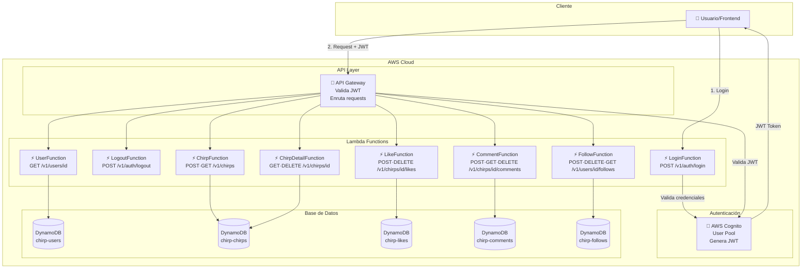

# 🔐 API con Smithy + Lambda + Cognito - Proyecto Chirp

**Estado:** 🚧 En Progreso
**Fase Actual:** Fase 3 - AWS Cognito
**Última actualización:** Abril 5, 2026

---

## 📚 Índice

1. [Introducción](#introducción)
2. [¿Qué es Smithy?](#qué-es-smithy)
3. [Arquitectura de la Solución](#arquitectura-de-la-solución)
4. [Fase 1: Configuración de Smithy](#fase-1-configuración-de-smithy)
5. [Fase 2: Modelos Smithy para los Endpoints](#fase-2-modelos-smithy-para-los-endpoints)
6. [Fase 3: AWS Cognito (AuthN)](#fase-3-aws-cognito-authn)
7. [Fase 4: Lambda Functions](#fase-4-lambda-functions)
8. [Fase 5: API Gateway](#fase-5-api-gateway)
9. [Fase 6: Autorización (AuthZ)](#fase-6-autorización-authz)
10. [Testing](#testing)
11. [Troubleshooting](#troubleshooting)

---

## Introducción

La API de Chirp expone **14 endpoints** organizados por dominio. Todos los endpoints (excepto Login) requieren autenticación JWT via `Bearer` token.

### 🔐 Autenticación
| Endpoint                | Método | Descripción        | Auth            |
| ----------------------- | ------ | ------------------ | --------------- |
| `/v1/auth/login`        | POST   | Iniciar sesión     | ❌ No (público) |
| `/v1/auth/logout`       | POST   | Cerrar sesión      | ✅ Sí           |

### 🐦 Chirps
| Endpoint                    | Método | Descripción              | Auth |
| --------------------------- | ------ | ------------------------ | ---- |
| `/v1/chirps`                | POST   | Crear un chirp           | ✅   |
| `/v1/chirps`                | GET    | Listar chirps (paginado) | ✅   |
| `/v1/chirps/{chirpId}`      | GET    | Obtener un chirp         | ✅   |
| `/v1/chirps/{chirpId}`      | DELETE | Eliminar un chirp        | ✅   |
| `/v1/chirps/{chirpId}/likes`| POST   | Dar like a un chirp      | ✅   |
| `/v1/chirps/{chirpId}/likes`| DELETE | Quitar like de un chirp  | ✅   |

### 💬 Comentarios
| Endpoint                                           | Método | Descripción               | Auth |
| -------------------------------------------------- | ------ | ------------------------- | ---- |
| `/v1/chirps/{chirpId}/comments`                    | POST   | Crear comentario          | ✅   |
| `/v1/chirps/{chirpId}/comments`                    | GET    | Listar comentarios        | ✅   |
| `/v1/chirps/{chirpId}/comments/{commentId}`        | DELETE | Eliminar comentario       | ✅   |

### 👥 Usuarios y Follows
| Endpoint                             | Método | Descripción               | Auth |
| ------------------------------------ | ------ | ------------------------- | ---- |
| `/v1/users/{userId}`                 | GET    | Obtener perfil de usuario | ✅   |
| `/v1/users/{userId}/follows`         | POST   | Seguir a un usuario       | ✅   |
| `/v1/users/{userId}/follows/{id}`    | DELETE | Dejar de seguir           | ✅   |
| `/v1/users/{userId}/followers`       | GET    | Listar seguidores         | ✅   |
| `/v1/users/{userId}/following`       | GET    | Listar seguidos           | ✅   |

---

## ¿Qué es Smithy?

**Smithy** es un lenguaje de definición de interfaces (IDL) creado por AWS para definir APIs de forma clara y generar código automáticamente.

### 🎯 Ventajas de Smithy

- **Define tu API una sola vez** → Genera código para servidor (Lambda) y cliente (SDK)
- **Validación automática** → Valida que los datos cumplan las reglas (ej: max 280 caracteres)
- **Documentación automática** → Genera OpenAPI/Swagger
- **Type-safety** → Evita errores de tipos entre frontend y backend

### 🔄 Flujo de Smithy

```
1. Escribes modelos en .smithy
   ↓
2. Smithy genera:
   - Código TypeScript/Node.js para Lambda
   - OpenAPI spec para API Gateway
   - SDK para el cliente
   ↓
3. Usas el código generado en tus Lambdas
```

---

## Arquitectura de la Solución



---

## Fase 1: Configuración de Smithy

### 📋 Checklist Fase 1

- [x] Verificar Java instalado (JDK 11+)
- [x] Instalar Gradle
- [x] Crear estructura de proyecto Smithy
- [x] Configurar build.gradle (con plugins openapi)
- [x] Configurar smithy-build.json (con plugin openapi)
- [x] Crear archivos de modelo Smithy (8 archivos)
- [x] Configurar Swagger UI para visualización local
- [x] Compilar y verificar (✅ BUILD SUCCESSFUL — 547 shapes)

---

### Paso 1.1: Verificar Java

**Smithy requiere Java JDK 11 o superior.**

```bash
# Verificar versión de Java
java -version

# Debe mostrar Java 11 o superior
# Ejemplo: openjdk version "17.0.15"
```

**Si no tienes Java instalado:**

1. Descarga Amazon Corretto 17: https://aws.amazon.com/corretto/
2. Instala el archivo `.msi`
3. Reinicia la terminal

---

### Paso 1.2: Crear Estructura de Archivos

```bash
# Ir a la carpeta smithy
cd C:/Jose/Cursos/Maestria\ Fullstack/31\ IA/Proyecto/twitter/smithy

# Crear carpetas necesarias
mkdir -p model
mkdir -p build-output
mkdir -p gradle/wrapper
```

**Estructura final:**

```
smithy/
├── model/                          # Modelos Smithy (namespace: com.chirp)
│   ├── main.smithy                 # Servicio principal + @httpBearerAuth
│   ├── common.smithy               # Tipos e IDs compartidos + errores
│   ├── auth.smithy                 # Login / Logout
│   ├── chirps.smithy               # Chirps CRUD + paginación
│   ├── users.smithy                # Perfil de usuario
│   ├── likes.smithy                # Likes de chirps
│   ├── comments.smithy             # Comentarios de chirps
│   └── follows.smithy              # Follows entre usuarios
├── gradle/
│   └── wrapper/                    # Gradle wrapper (generado)
├── build/                          # Output del build (gitignored)
│   └── smithyprojections/
│       └── chirp-smithy/source/
│           └── openapi/
│               └── ChirpService.openapi.json  # Spec OpenAPI generado
├── build.gradle                    # Configuración de Gradle
├── settings.gradle                 # Configuración del proyecto
├── gradle.properties               # Propiedades de Gradle
├── smithy-build.json               # Configuración de Smithy + plugin openapi
├── package.json                    # Script npm run swagger
├── gradlew                         # Script de Gradle (Unix)
└── gradlew.bat                     # Script de Gradle (Windows)
```

---

### Paso 1.3: Crear build.gradle

Este archivo configura el proyecto Gradle para compilar Smithy.

**Crear:** `smithy/build.gradle`

```gradle
plugins {
    id 'java-library'
    id 'software.amazon.smithy.gradle.smithy-jar' version '0.10.0'
}

repositories {
    mavenLocal()
    mavenCentral()
}

dependencies {
    implementation 'software.amazon.smithy:smithy-model:1.45.0'
    implementation 'software.amazon.smithy:smithy-aws-traits:1.45.0'
    implementation 'software.amazon.smithy:smithy-linters:1.45.0'
    // Plugins para generar OpenAPI spec desde los modelos Smithy
    implementation 'software.amazon.smithy:smithy-openapi:1.45.0'
    implementation 'software.amazon.smithy:smithy-aws-apigateway-openapi:1.45.0'
}
```

---

### Paso 1.4: Crear settings.gradle

**Crear:** `smithy/settings.gradle`

```gradle
rootProject.name = 'chirp-smithy'
```

---

### Paso 1.5: Crear gradle.properties

**Crear:** `smithy/gradle.properties`

```properties
org.gradle.jvmargs=-Xmx2g
org.gradle.daemon=true
org.gradle.parallel=true
```

---

### Paso 1.6: Crear smithy-build.json

Este archivo configura cómo Smithy procesa los modelos.

**Crear:** `smithy/smithy-build.json`

```json
{
  "version": "1.0",
  "sources": ["model"],
  "plugins": {
    "build-info": {
      "version": "1.0.0",
      "sdkId": "Chirp"
    },
    "openapi": {
      "service": "com.chirp#ChirpService",
      "version": "3.0.2"
    }
  }
}
```

El plugin `openapi` genera el archivo `build/smithyprojections/chirp-smithy/source/openapi/ChirpService.openapi.json` que se usa para Swagger UI.

---

### Paso 1.7: Inicializar Gradle Wrapper

```bash
# Desde la carpeta smithy/
gradle wrapper --gradle-version 8.5

# Dar permisos de ejecución (en Git Bash)
chmod +x gradlew
```

**Si "gradle" no se encuentra:**

- Instala Gradle con Chocolatey: `choco install gradle`
- O descarga desde: https://gradle.org/releases/

---

## Fase 2: Modelos Smithy para los Endpoints

### 📋 Checklist Fase 2

- [x] Crear `common.smithy` — tipos compartidos, IDs, errores
- [x] Crear `auth.smithy` — Login / Logout
- [x] Crear `chirps.smithy` — CRUD de chirps + recurso con sub-recursos
- [x] Crear `users.smithy` — perfil de usuario
- [x] Crear `likes.smithy` — likes de chirps
- [x] Crear `comments.smithy` — comentarios de chirps
- [x] Crear `follows.smithy` — follows entre usuarios
- [x] Crear `main.smithy` — servicio principal con `@httpBearerAuth`
- [x] Compilar y verificar (✅ **547 shapes** validados)
- [x] Verificar Swagger UI con todos los endpoints

---

### Paso 2.1: Crear common.smithy

Contiene todos los tipos e IDs compartidos y los errores HTTP estándar. **Todos los archivos usan el namespace `com.chirp`** — no se necesitan `use` statements entre archivos del mismo namespace.

**Archivo:** `smithy/model/common.smithy`

```smithy
$version: "2"

namespace com.chirp

// ─── IDs ─────────────────────────────────────────────────────────────────────

/// UUID v4 de usuario
@pattern("^[0-9a-f]{8}-[0-9a-f]{4}-4[0-9a-f]{3}-[89ab][0-9a-f]{3}-[0-9a-f]{12}$")
string UserId

/// UUID v4 de chirp
@pattern("^[0-9a-f]{8}-[0-9a-f]{4}-4[0-9a-f]{3}-[89ab][0-9a-f]{3}-[0-9a-f]{12}$")
string ChirpId

/// UUID v4 de comentario
@pattern("^[0-9a-f]{8}-[0-9a-f]{4}-4[0-9a-f]{3}-[89ab][0-9a-f]{3}-[0-9a-f]{12}$")
string CommentId

// ─── Tipos comunes ────────────────────────────────────────────────────────────

/// Timestamp ISO 8601 (ej: 2026-04-05T12:00:00Z)
@pattern("^[0-9]{4}-[0-9]{2}-[0-9]{2}T[0-9]{2}:[0-9]{2}:[0-9]{2}Z$")
string Timestamp

/// URL de media (imagen o video)
@length(min: 1, max: 2048)
string MediaUrl

list MediaUrlList { member: MediaUrl }

/// Token de paginación
string NextToken

/// Tamaño de página (1–100)
@range(min: 1, max: 100)
integer PageSize

/// Email válido
@pattern("^[a-zA-Z0-9._%+-]+@[a-zA-Z0-9.-]+\\.[a-zA-Z]{2,}$")
string Email

// ─── Errores ─────────────────────────────────────────────────────────────────

@error("client") @httpError(400)
structure BadRequestError { @required message: String }

@error("client") @httpError(401)
structure UnauthorizedError { @required message: String }

@error("client") @httpError(403)
structure ForbiddenError { @required message: String }

@error("client") @httpError(404)
structure NotFoundError { @required message: String }

@error("client") @httpError(409)
structure ConflictError { @required message: String }

@error("server") @httpError(500)
structure InternalServerError { @required message: String }
```

---

### Paso 2.2: Crear auth.smithy

**Archivo:** `smithy/model/auth.smithy`

```smithy
$version: "2"

namespace com.chirp

// ─── Login ────────────────────────────────────────────────────────────────────

/// Autenticación de usuario con email y contraseña
@http(method: "POST", uri: "/v1/auth/login", code: 200)
operation Login {
    input: LoginInput
    output: LoginOutput
    errors: [BadRequestError, UnauthorizedError]
}

@input
structure LoginInput {
    @required
    email: Email

    @required
    @length(min: 8, max: 128)
    password: String
}

@output
structure LoginOutput {
    @required accessToken: String
    @required idToken: String
    @required refreshToken: String
    @required expiresIn: Integer
    @required tokenType: String
}

// ─── Logout ───────────────────────────────────────────────────────────────────

/// Cierre de sesión del usuario autenticado
@http(method: "POST", uri: "/v1/auth/logout", code: 200)
operation Logout {
    input: LogoutInput
    output: LogoutOutput
    errors: [UnauthorizedError]
}

@input
structure LogoutInput {}

@output
structure LogoutOutput {
    @required message: String
}
```

**Nota:** El token JWT viene en el header `Authorization: Bearer <token>`. El Cognito Authorizer en API Gateway lo validará automáticamente (Fase 5).

---

### Paso 2.3: Crear chirps.smithy

Define el recurso `ChirpResource` con operaciones CRUD y sub-recursos de likes y comentarios.

**Archivo:** `smithy/model/chirps.smithy`

```smithy
$version: "2"

namespace com.chirp

resource ChirpResource {
    identifiers: { chirpId: ChirpId }
    create: CreateChirp
    read: GetChirp
    delete: DeleteChirp
    list: ListChirps
    resources: [LikeResource, CommentResource]
}

@length(min: 1, max: 280)
string ChirpContent

structure Chirp {
    @required chirpId: ChirpId
    @required userId: UserId
    @required content: ChirpContent
    mediaUrls: MediaUrlList
    @required likesCount: Integer
    @required repostsCount: Integer
    parentChirpId: ChirpId
    @required createdAt: Timestamp
}

list ChirpList { member: Chirp }

// CreateChirp — POST /v1/chirps
@http(method: "POST", uri: "/v1/chirps", code: 201)
operation CreateChirp {
    input: CreateChirpInput
    output: CreateChirpOutput
    errors: [BadRequestError]
}
@input
structure CreateChirpInput {
    @required content: ChirpContent
    mediaUrls: MediaUrlList
    parentChirpId: ChirpId
}
@output
structure CreateChirpOutput { @required @httpPayload chirp: Chirp }

// GetChirp — GET /v1/chirps/{chirpId}
@readonly
@http(method: "GET", uri: "/v1/chirps/{chirpId}", code: 200)
operation GetChirp {
    input: GetChirpInput
    output: GetChirpOutput
    errors: [NotFoundError]
}
@input
structure GetChirpInput { @required @httpLabel chirpId: ChirpId }
@output
structure GetChirpOutput { @required @httpPayload chirp: Chirp }

// DeleteChirp — DELETE /v1/chirps/{chirpId}
@idempotent
@http(method: "DELETE", uri: "/v1/chirps/{chirpId}", code: 204)
operation DeleteChirp {
    input: DeleteChirpInput
    output: DeleteChirpOutput
    errors: [NotFoundError, ForbiddenError]
}
@input
structure DeleteChirpInput { @required @httpLabel chirpId: ChirpId }
@output
structure DeleteChirpOutput {}

// ListChirps — GET /v1/chirps?userId=...&pageSize=...&nextToken=...
@readonly
@http(method: "GET", uri: "/v1/chirps", code: 200)
operation ListChirps {
    input: ListChirpsInput
    output: ListChirpsOutput
}
@input
structure ListChirpsInput {
    @httpQuery("userId") userId: UserId
    @httpQuery("pageSize") pageSize: PageSize
    @httpQuery("nextToken") nextToken: NextToken
}
@output
structure ListChirpsOutput {
    @required chirps: ChirpList
    nextToken: NextToken
}
```

---

### Paso 2.4: Crear users.smithy

**Archivo:** `smithy/model/users.smithy`

```smithy
$version: "2"

namespace com.chirp

resource UserResource {
    identifiers: { userId: UserId }
    read: GetUser
}

@length(min: 3, max: 30)
@pattern("^[a-zA-Z0-9_]+$")
string Username

@length(min: 1, max: 100)
string DisplayName

@length(min: 0, max: 160)
string Bio

structure User {
    @required userId: UserId
    @required username: Username
    @required email: Email
    @required displayName: DisplayName
    bio: Bio
    avatarUrl: MediaUrl
    @required verified: Boolean
    @required createdAt: Timestamp
}

list UserList { member: User }

@readonly
@http(method: "GET", uri: "/v1/users/{userId}", code: 200)
operation GetUser {
    input: GetUserInput
    output: GetUserOutput
    errors: [NotFoundError]
}
@input
structure GetUserInput { @required @httpLabel userId: UserId }
@output
structure GetUserOutput { @required @httpPayload user: User }
```

---

### Paso 2.5: Crear likes.smithy

**Archivo:** `smithy/model/likes.smithy`

```smithy
$version: "2"

namespace com.chirp

resource LikeResource {
    identifiers: { chirpId: ChirpId }
    operations: [LikeChirp, UnlikeChirp]
}

structure Like {
    @required chirpId: ChirpId
    @required userId: UserId
    @required createdAt: Timestamp
}

// POST /v1/chirps/{chirpId}/likes
@http(method: "POST", uri: "/v1/chirps/{chirpId}/likes", code: 201)
operation LikeChirp {
    input: LikeChirpInput
    output: LikeChirpOutput
    errors: [NotFoundError, ConflictError, ForbiddenError]
}
@input
structure LikeChirpInput { @required @httpLabel chirpId: ChirpId }
@output
structure LikeChirpOutput { @required @httpPayload like: Like }

// DELETE /v1/chirps/{chirpId}/likes
@idempotent
@http(method: "DELETE", uri: "/v1/chirps/{chirpId}/likes", code: 204)
operation UnlikeChirp {
    input: UnlikeChirpInput
    output: UnlikeChirpOutput
    errors: [NotFoundError, ForbiddenError]
}
@input
structure UnlikeChirpInput { @required @httpLabel chirpId: ChirpId }
@output
structure UnlikeChirpOutput {}
```

---

### Paso 2.6: Crear comments.smithy

**Archivo:** `smithy/model/comments.smithy`

```smithy
$version: "2"

namespace com.chirp

resource CommentResource {
    identifiers: { chirpId: ChirpId, commentId: CommentId }
    create: CreateComment
    delete: DeleteComment
    list: ListComments
}

@length(min: 1, max: 500)
string CommentContent

structure Comment {
    @required commentId: CommentId
    @required chirpId: ChirpId
    @required userId: UserId
    @required content: CommentContent
    @required createdAt: Timestamp
}

list CommentList { member: Comment }

// POST /v1/chirps/{chirpId}/comments
@http(method: "POST", uri: "/v1/chirps/{chirpId}/comments", code: 201)
operation CreateComment {
    input: CreateCommentInput
    output: CreateCommentOutput
    errors: [BadRequestError, NotFoundError]
}
@input
structure CreateCommentInput {
    @required @httpLabel chirpId: ChirpId
    @required content: CommentContent
}
@output
structure CreateCommentOutput { @required @httpPayload comment: Comment }

// DELETE /v1/chirps/{chirpId}/comments/{commentId}
@idempotent
@http(method: "DELETE", uri: "/v1/chirps/{chirpId}/comments/{commentId}", code: 204)
operation DeleteComment {
    input: DeleteCommentInput
    output: DeleteCommentOutput
    errors: [NotFoundError, ForbiddenError]
}
@input
structure DeleteCommentInput {
    @required @httpLabel chirpId: ChirpId
    @required @httpLabel commentId: CommentId
}
@output
structure DeleteCommentOutput {}

// GET /v1/chirps/{chirpId}/comments
@readonly
@http(method: "GET", uri: "/v1/chirps/{chirpId}/comments", code: 200)
operation ListComments {
    input: ListCommentsInput
    output: ListCommentsOutput
    errors: [NotFoundError]
}
@input
structure ListCommentsInput {
    @required @httpLabel chirpId: ChirpId
    @httpQuery("pageSize") pageSize: PageSize
    @httpQuery("nextToken") nextToken: NextToken
}
@output
structure ListCommentsOutput {
    @required comments: CommentList
    nextToken: NextToken
}
```

---

### Paso 2.7: Crear follows.smithy

**Archivo:** `smithy/model/follows.smithy`

```smithy
$version: "2"

namespace com.chirp

resource FollowResource {
    identifiers: { userId: UserId, followedId: UserId }
    create: FollowUser
    delete: UnfollowUser
}

structure Follow {
    @required followerId: UserId
    @required followedId: UserId
    @required createdAt: Timestamp
}

// POST /v1/users/{userId}/follows
@http(method: "POST", uri: "/v1/users/{userId}/follows", code: 201)
operation FollowUser {
    input: FollowUserInput
    output: FollowUserOutput
    errors: [BadRequestError, NotFoundError, ConflictError, ForbiddenError]
}
@input
structure FollowUserInput { @required @httpLabel userId: UserId }
@output
structure FollowUserOutput { @required @httpPayload follow: Follow }

// DELETE /v1/users/{userId}/follows/{followedId}
@idempotent
@http(method: "DELETE", uri: "/v1/users/{userId}/follows/{followedId}", code: 204)
operation UnfollowUser {
    input: UnfollowUserInput
    output: UnfollowUserOutput
    errors: [NotFoundError, ForbiddenError]
}
@input
structure UnfollowUserInput {
    @required @httpLabel userId: UserId
    @required @httpLabel followedId: UserId
}
@output
structure UnfollowUserOutput {}

// GET /v1/users/{userId}/followers
@readonly
@http(method: "GET", uri: "/v1/users/{userId}/followers", code: 200)
operation ListFollowers {
    input: ListFollowersInput
    output: ListFollowersOutput
    errors: [NotFoundError]
}
@input
structure ListFollowersInput {
    @required @httpLabel userId: UserId
    @httpQuery("pageSize") pageSize: PageSize
    @httpQuery("nextToken") nextToken: NextToken
}
@output
structure ListFollowersOutput {
    @required followers: UserList
    nextToken: NextToken
}

// GET /v1/users/{userId}/following
@readonly
@http(method: "GET", uri: "/v1/users/{userId}/following", code: 200)
operation ListFollowing {
    input: ListFollowingInput
    output: ListFollowingOutput
    errors: [NotFoundError]
}
@input
structure ListFollowingInput {
    @required @httpLabel userId: UserId
    @httpQuery("pageSize") pageSize: PageSize
    @httpQuery("nextToken") nextToken: NextToken
}
@output
structure ListFollowingOutput {
    @required following: UserList
    nextToken: NextToken
}
```

---

### Paso 2.8: Crear main.smithy

Punto de entrada del servicio. Orquesta todos los resources y operaciones con `@httpBearerAuth`.

**Archivo:** `smithy/model/main.smithy`

```smithy
$version: "2"

namespace com.chirp

use aws.protocols#restJson1

/// Servicio principal de la API de Chirp
@title("Chirp API")
@restJson1
@httpBearerAuth
@paginated(inputToken: "nextToken", outputToken: "nextToken", pageSize: "pageSize")
service ChirpService {
    version: "2026-04-04"
    resources: [
        UserResource
        ChirpResource
    ]
    operations: [
        Login
        Logout
        ListFollowers
        ListFollowing
    ]
    errors: [
        UnauthorizedError
        ForbiddenError
        InternalServerError
    ]
}
```

---

### Paso 2.9: Compilar y verificar

```bash
# Desde la carpeta smithy/
./gradlew clean build
```

**Salida esperada:**
```
BUILD SUCCESSFUL
547 shapes validated
4 plugins executed: smithyFormat, smithyBuild, smithyJarValidate, openapi
12 artifacts generated
```

**Swagger UI local** — para visualizar todos los endpoints:
```bash
npm run swagger
# Abre http://localhost:8080/swagger-ui.html
```

**Si hay errores:**
- Smithy da mensajes muy descriptivos con el archivo y línea exacta
- Ejecuta `./gradlew clean build` para limpiar y recompilar
- Verifica que todos los shapes referenciados existen en el mismo namespace `com.chirp`

---

## Fase 3: AWS Cognito (AuthN)

### 📋 Checklist Fase 3

- [ ] Crear User Pool en Cognito
- [ ] Configurar App Client
- [ ] Configurar dominios de auth
- [ ] Agregar Cognito al stack CDK
- [ ] Desplegar Cognito
- [ ] Crear usuario de prueba

---

### Paso 3.1: Agregar Cognito al Stack CDK

**Archivo:** `infrastructure/lib/infrastructure-stack.ts`

Agregar al final del constructor (antes del cierre):

```typescript
// ========================================================================
// AWS COGNITO - USER POOL
// ========================================================================
// User Pool para autenticación de usuarios
const userPool = new cognito.UserPool(this, "ChirpUserPool", {
  userPoolName: "chirp-user-pool",

  // Login con email
  signInAliases: {
    email: true,
    username: false,
  },

  // Atributos requeridos
  standardAttributes: {
    email: {
      required: true,
      mutable: false,
    },
    preferredUsername: {
      required: true,
      mutable: true,
    },
    profile: {
      required: false,
      mutable: true,
    },
  },

  // Atributos personalizados
  customAttributes: {
    displayName: new cognito.StringAttribute({
      minLen: 1,
      maxLen: 100,
      mutable: true,
    }),
    bio: new cognito.StringAttribute({ minLen: 0, maxLen: 160, mutable: true }),
  },

  // Políticas de contraseña
  passwordPolicy: {
    minLength: 8,
    requireLowercase: true,
    requireUppercase: true,
    requireDigits: true,
    requireSymbols: false,
  },

  // Verificación de email
  autoVerify: {
    email: true,
  },

  // Configuración de email
  email: cognito.UserPoolEmail.withCognito(),

  // Retención de usuarios eliminados
  removalPolicy: cdk.RemovalPolicy.RETAIN, // En producción: RETAIN

  // MFA (opcional, para mayor seguridad)
  mfa: cognito.Mfa.OPTIONAL,
  mfaSecondFactor: {
    sms: false,
    otp: true, // Autenticador TOTP (Google Authenticator, etc.)
  },
});

// ========================================================================
// USER POOL CLIENT
// ========================================================================
// Client para la aplicación web/móvil
const userPoolClient = userPool.addClient("ChirpWebClient", {
  userPoolClientName: "chirp-web-client",

  // Flows de autenticación permitidos
  authFlows: {
    userPassword: true, // Usuario + contraseña
    userSrp: true, // Secure Remote Password
    custom: false,
    adminUserPassword: false,
  },

  // OAuth flows
  oAuth: {
    flows: {
      authorizationCodeGrant: true,
      implicitCodeGrant: false,
    },
    scopes: [
      cognito.OAuthScope.EMAIL,
      cognito.OAuthScope.OPENID,
      cognito.OAuthScope.PROFILE,
    ],
    callbackUrls: [
      "http://localhost:3000/callback", // Desarrollo
      "https://chirp.example.com/callback", // Producción
    ],
    logoutUrls: ["http://localhost:3000", "https://chirp.example.com"],
  },

  // Configuración de tokens
  accessTokenValidity: cdk.Duration.hours(1),
  idTokenValidity: cdk.Duration.hours(1),
  refreshTokenValidity: cdk.Duration.days(30),

  // Prevenir secreto de cliente (mejor para SPAs)
  generateSecret: false,
});

// ========================================================================
// USER POOL DOMAIN
// ========================================================================
// Dominio para Hosted UI (opcional pero útil)
const userPoolDomain = userPool.addDomain("ChirpUserPoolDomain", {
  cognitoDomain: {
    domainPrefix: "chirp-auth-dev", // Debe ser único en AWS
  },
});

// ========================================================================
// OUTPUTS - Cognito
// ========================================================================
new cdk.CfnOutput(this, "UserPoolId", {
  value: userPool.userPoolId,
  description: "ID del User Pool de Cognito",
  exportName: "ChirpUserPoolId",
});

new cdk.CfnOutput(this, "UserPoolClientId", {
  value: userPoolClient.userPoolClientId,
  description: "ID del Client del User Pool",
  exportName: "ChirpUserPoolClientId",
});

new cdk.CfnOutput(this, "UserPoolDomainUrl", {
  value: `https://${userPoolDomain.domainName}.auth.${this.region}.amazoncognito.com`,
  description: "URL del dominio de autenticación",
  exportName: "ChirpUserPoolDomainUrl",
});
```

**Agregar import al inicio del archivo:**

```typescript
import * as cognito from "aws-cdk-lib/aws-cognito";
```

---

### Paso 3.2: Desplegar Cognito

```bash
cd infrastructure

# Compilar
npm run build

# Ver diferencias
npx cdk diff

# Desplegar
npx cdk deploy
```

**Salida esperada:**

```
✨  Synthesis time: X.XXs

InfrastructureStack: deploying...

✅  InfrastructureStack

Outputs:
InfrastructureStack.UserPoolId = us-east-1_XXXXXXXXX
InfrastructureStack.UserPoolClientId = XXXXXXXXXXXXXXXXXXXXXXXXXX
InfrastructureStack.UserPoolDomainUrl = https://chirp-auth-dev.auth.us-east-1.amazoncognito.com
[...]
```

**Guardar estos valores**, los necesitaremos después.

---

### Paso 3.3: Crear Usuario de Prueba

```bash
# Obtener User Pool ID del output
USER_POOL_ID="us-east-1_XXXXXXXXX"  # Reemplazar con tu valor

# Crear usuario de prueba
aws cognito-idp admin-create-user \
  --user-pool-id $USER_POOL_ID \
  --username testuser@example.com \
  --user-attributes \
    Name=email,Value=testuser@example.com \
    Name=email_verified,Value=true \
    Name=preferred_username,Value=testuser \
    Name=custom:displayName,Value="Test User" \
  --temporary-password "TempPass123!" \
  --message-action SUPPRESS

# Establecer contraseña permanente
aws cognito-idp admin-set-user-password \
  --user-pool-id $USER_POOL_ID \
  --username testuser@example.com \
  --password "MyPassword123!" \
  --permanent
```

**Usuario creado:**

- Email: `testuser@example.com`
- Password: `MyPassword123!`

---

## Fase 4: Lambda Functions

### 📋 Checklist Fase 4

- [ ] Crear estructura de Lambda Functions
- [ ] Implementar LoginFunction (`POST /v1/auth/login`)
- [ ] Implementar LogoutFunction (`POST /v1/auth/logout`)
- [ ] Implementar CreateChirpFunction (`POST /v1/chirps`)
- [ ] Implementar GetChirpFunction (`GET /v1/chirps/{chirpId}`)
- [ ] Implementar DeleteChirpFunction (`DELETE /v1/chirps/{chirpId}`)
- [ ] Implementar ListChirpsFunction (`GET /v1/chirps`)
- [ ] Implementar LikeChirpFunction (`POST /v1/chirps/{chirpId}/likes`)
- [ ] Implementar UnlikeChirpFunction (`DELETE /v1/chirps/{chirpId}/likes`)
- [ ] Implementar CreateCommentFunction (`POST /v1/chirps/{chirpId}/comments`)
- [ ] Implementar DeleteCommentFunction (`DELETE /v1/chirps/{chirpId}/comments/{commentId}`)
- [ ] Implementar ListCommentsFunction (`GET /v1/chirps/{chirpId}/comments`)
- [ ] Implementar GetUserFunction (`GET /v1/users/{userId}`)
- [ ] Implementar FollowUserFunction (`POST /v1/users/{userId}/follows`)
- [ ] Implementar UnfollowUserFunction (`DELETE /v1/users/{userId}/follows/{followedId}`)
- [ ] Implementar ListFollowersFunction (`GET /v1/users/{userId}/followers`)
- [ ] Implementar ListFollowingFunction (`GET /v1/users/{userId}/following`)
- [ ] Agregar Lambdas al Stack CDK
- [ ] Desplegar Lambdas

---

### Paso 4.1: Crear Estructura de Lambda Functions

```bash
# Desde la raíz del proyecto
cd twitter/

# Crear estructura
mkdir -p lambda/src/handlers/auth
mkdir -p lambda/src/handlers/chirps
mkdir -p lambda/src/handlers/users
mkdir -p lambda/src/handlers/comments
mkdir -p lambda/src/handlers/follows
mkdir -p lambda/src/middleware
mkdir -p lambda/src/services
mkdir -p lambda/src/utils

# Crear package.json
cd lambda
npm init -y
```

**Instalar dependencias:**

```bash
npm install \
  @aws-sdk/client-cognito-identity-provider \
  @aws-sdk/client-dynamodb \
  @aws-sdk/lib-dynamodb \
  uuid \
  jsonwebtoken \
  jwk-to-pem

npm install --save-dev \
  @types/node \
  @types/aws-lambda \
  typescript
```

---

### Paso 4.2: Configurar TypeScript

**Crear:** `lambda/tsconfig.json`

```json
{
  "compilerOptions": {
    "target": "ES2022",
    "module": "NodeNext",
    "moduleResolution": "NodeNext",
    "lib": ["ES2022"],
    "outDir": "./dist",
    "rootDir": "./src",
    "strict": true,
    "esModuleInterop": true,
    "skipLibCheck": true,
    "forceConsistentCasingInFileNames": true,
    "resolveJsonModule": true
  },
  "include": ["src/**/*"],
  "exclude": ["node_modules", "dist"]
}
```

**Actualizar `lambda/package.json`:**

```json
{
  "name": "chirp-lambda-functions",
  "version": "1.0.0",
  "type": "module",
  "scripts": {
    "build": "tsc",
    "watch": "tsc --watch"
  },
  "dependencies": {
    "@aws-sdk/client-cognito-identity-provider": "^3.x.x",
    "@aws-sdk/client-dynamodb": "^3.x.x",
    "@aws-sdk/lib-dynamodb": "^3.x.x",
    "uuid": "^9.x.x",
    "jsonwebtoken": "^9.x.x",
    "jwk-to-pem": "^2.x.x"
  },
  "devDependencies": {
    "@types/node": "^20.x.x",
    "@types/aws-lambda": "^8.x.x",
    "typescript": "^5.x.x"
  }
}
```

---

### 🎯 Estado Actual

**Completado:**

- ✅ Fase 1: Configuración de Smithy (Gradle + dependencias OpenAPI)
- ✅ Fase 2: 8 modelos Smithy compilados — **547 shapes validados**, 14 endpoints, namespace único `com.chirp`
  - `common.smithy` — tipos compartidos (IDs, Timestamp, MediaUrl, 6 errores HTTP)
  - `auth.smithy` — Login / Logout
  - `chirps.smithy` — CRUD de chirps + paginación
  - `users.smithy` — perfil de usuario
  - `likes.smithy` — likes de chirps
  - `comments.smithy` — comentarios de chirps
  - `follows.smithy` — follows entre usuarios
  - `main.smithy` — servicio con `@httpBearerAuth` + `@paginated`
- ✅ OpenAPI spec generado: `build/smithyprojections/chirp-smithy/source/openapi/ChirpService.openapi.json`
- ✅ Swagger UI local disponible: `npm run swagger` → `http://localhost:8080/swagger-ui.html`
- ➖ Fase 3: AWS Cognito configurado en CDK (pendiente de deploy)

**En Progreso:**

- 🚧 Fase 4: Lambda Functions (17 handlers por implementar)

**Pendiente:**

- ⬜ Fase 5: API Gateway
- ⬜ Fase 6: Autorización (AuthZ)
- ⬜ Testing

**🔍 Nota sobre Autenticación:**
El modelo Smithy ya declara `@httpBearerAuth` en el servicio. Esto se refleja en el spec OpenAPI generado con `securitySchemes`. La validación real del token JWT se implementa en la **Fase 5** con el Cognito Authorizer de API Gateway.

---

## Próximos Pasos

1. **Desplegar Cognito** (Fase 3) — `cdk deploy` del stack de infraestructura
2. **Implementar LoginFunction** — Handler para autenticación con Cognito
3. **Implementar los 16 handlers restantes** — CRUD de chirps, comentarios, follows, likes, usuarios
4. **Configurar API Gateway** — Exponer las Lambdas como REST API con Cognito Authorizer
5. **Testing end-to-end** — Probar todo el flujo con los contratos del OpenAPI spec

---

**Fecha de última actualización:** Abril 5, 2026
**Proyecto:** Chirp - Plataforma de Microblogging
