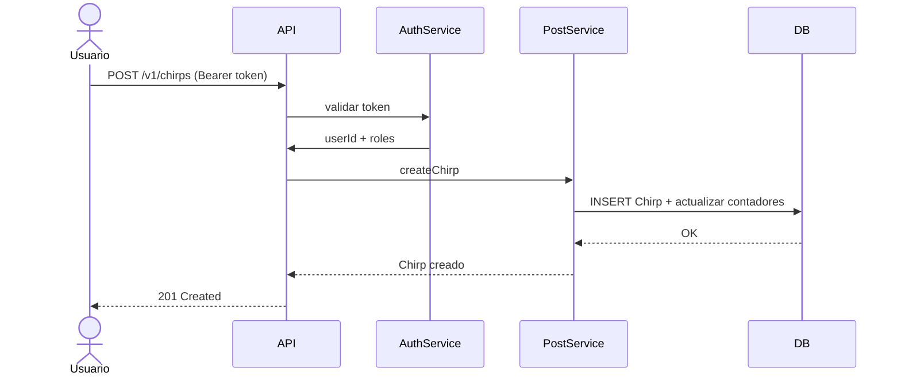
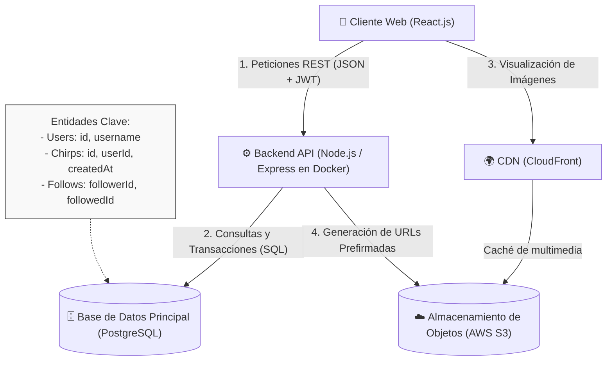
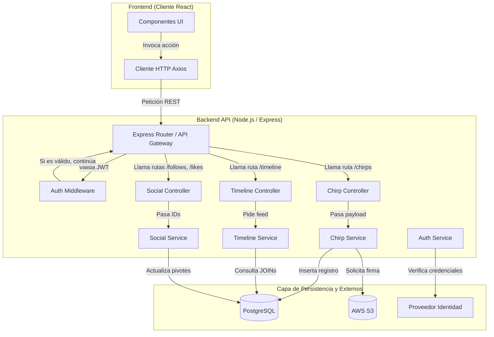
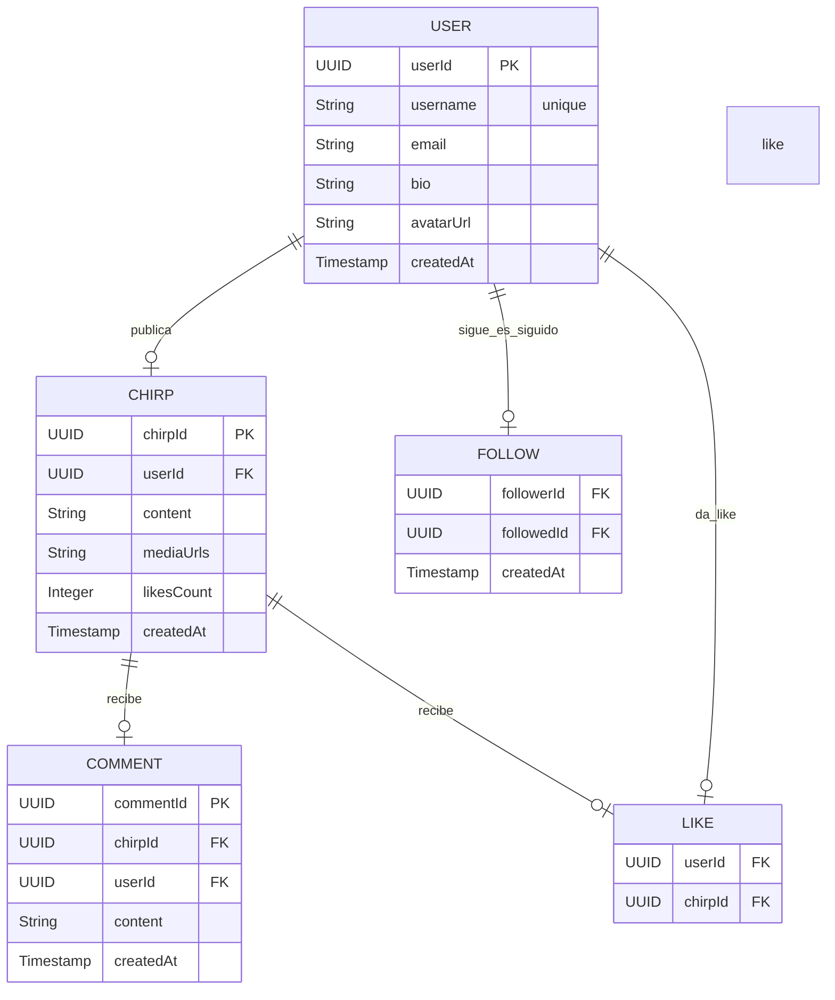

# PROYECTO CHIRP - Diseño Técnico
**ESTADO DEL DOCUMENTO:** EN REVISION
## Resumen
Chirp es una plataforma de microblogueo social en tiempo real, similar a otras redes de mensajes cortos. Permite a los usuarios crear chirps (publicaciones de hasta 280 caracteres), seguir a otros perfiles, visualizar un cronograma personalizado, dar “me gusta” y comentar. El objetivo principal es ofrecer una experiencia de interacción instantánea, con alta disponibilidad y capacidad de crecimiento en la nube.  

## Supuestos
- Todos los usuarios tienen acceso a internet y un navegador moderno.
- El sistema se desplegará en AWS (o equivalente cloud).
- Se utilizará un proveedor de identidad externo para OIDC/SSO.

## Alcance y Fases
Fase 1 (esta entrega):** CRUD de usuarios, chirps, follows, likes y comentarios + AuthN/AuthZ completa.
Fuera del alcance (Fase 2/3): Notificaciones push, búsqueda avanzada con Elasticsearch, trending topics.

## 1. Requerimientos *(~5 minutos)*

### 1.1 Requerimientos Funcionales

**RF1: Creación de Publicaciones (Prioridad Alta)**

Descripción del requerimiento: El núcleo de escritura del sistema. Permite la inserción de nuevos registros de texto corto en la base de datos, reflejándose inmediatamente en el perfil del autor.<br>
**Historia de Usuario (HU-01):**<br>
Actor: Como usuario autenticado...<br>
Objetivo: ...quiero crear y publicar un chirp de hasta 280 caracteres...<br>
Razón: ...para compartir mis ideas y actualizaciones al instante con mi audiencia.<br>
Criterios de Aceptación:<br>
Los usuarios deben poder ingresar texto en un área de captura.
El sistema debe mostrar un indicador visual que bloquee la publicación si el texto excede los 280 caracteres.
El sistema debe guardar la publicación relacionándola con el usuario y mostrarla de inmediato tras presionar el botón "Publicar".<br>

**RF2: Generación del Timeline (Prioridad Alta)**

Descripción del requerimiento: El motor de lectura principal. Requiere recolectar y ordenar las publicaciones basándose en el grafo de seguidores del usuario activo para construir su feed principal.<br>
**Historia de Usuario (HU-02):**<br>
Actor: Como usuario de la plataforma...  <br>
Objetivo: ...quiero visualizar un timeline personalizado ordenado cronológicamente...<br>
Razón: ...para mantenerme actualizado de forma centralizada con las publicaciones de las cuentas que sigo.<br>
Criterios de Aceptación:<br>
Los usuarios deben poder acceder a una pantalla principal inmediatamente después de iniciar sesión.
El sistema debe mostrar un flujo continuo de chirps provenientes únicamente de los perfiles a los que el usuario ha dado "Follow".
Los usuarios deben poder hacer scroll hacia abajo para cargar publicaciones más antiguas mediante paginación o scroll infinito sin bloquear la interfaz.<br>

**RF3: Interacción Social - Likes (Prioridad Media)**<br>
Descripción del requerimiento: Sistema de validación positiva. Registra la interacción única entre un usuario y una publicación, actualizando contadores de forma transaccional.<br>
**Historia de Usuario (HU-03):<br>**
Actor: Como usuario activo...<br>
Objetivo: ...quiero dar o quitar "Like" a los chirps de la comunidad...<br>
Razón: ...para mostrar aprecio por el contenido de otros y participar en la red.<br>
Criterios de Aceptación:<br>
Los usuarios deben poder hacer clic en un icono de corazón ("Like") para sumar una unidad al contador público de esa publicación.
El sistema debe validar en la base de datos que un usuario no pueda registrar más de un Like en el mismo chirp.
Los usuarios deben poder revertir su "Like" haciendo clic nuevamente (toggle) para disminuir el contador.

### 1.2 Requerimientos No Funcionales

RNF 1: Latencia (Dimensión: Latencia)
Requerimiento: El sistema backend debe generar y entregar la respuesta de lectura del Timeline principal en un tiempo < 400 ms en el percentil 95 (p95) bajo condiciones de tráfico normal.<br>
Contextualización: Para lograr esto sin arquitecturas excesivamente complejas en la fase inicial, se implementará paginación basada en cursores (cargando lotes de 20 chirps) y se evitarán consultas anidadas profundas en la base de datos al momento de cargar el feed.

RNF 2: Escalabilidad de la Infraestructura (Dimensión: Escalabilidad)
Requerimiento: La arquitectura contenerizada debe ser capaz de soportar una base de 1000 Usuarios Activos Diarios (DAU) y manejar picos de concurrencia de hasta 100 Peticiones Por Segundo (QPS) sin degradación del servicio.<br>
Contextualización: Se asume una proporción de operaciones de lectura/escritura de 10:1. Para cumplir con esto de forma realista, se desplegarán múltiples instancias del contenedor de la API (Node.js/Express) balanceadas, separando las cargas de trabajo de la base de datos relacional y documental.

RNF 3: Disponibilidad y Teorema CAP (Dimensión: CAP / Tolerancia a fallos)<br>
Requerimiento: El sistema debe garantizar un 99.9% de uptime mensual (permitiendo un máximo de ~43 minutos de inactividad al mes) para las funciones críticas: leer el timeline y publicar chirps.<br>
Contextualización: El sistema priorizará la Disponibilidad (A) sobre la Consistencia fuerte (C) del Teorema CAP. Si hay alta carga o falla un proceso asíncrono, se acepta una consistencia eventual donde los contadores secundarios (cantidad total de likes o respuestas) puedan tardar hasta 5 segundos en reflejarse correctamente en todos los clientes.

RNF 4: Restricciones de Seguridad (Dimensión: Seguridad)<br>
Requerimiento: Las APIs públicas del sistema deben aplicar políticas de Rate Limiting que bloqueen las peticiones de escritura si un usuario supera el límite de 30 chirps creados por hora. Además, el 100% de los datos de entrada de texto deben ser sanitizados.<br>
Contextualización: Esto previene ataques de denegación de servicio (DDoS) a nivel de aplicación, controla el spam automatizado (bots) y asegura que no exista inyección de código malicioso (XSS) que afecte el renderizado en el frontend.<br>

### 1.3 Estimación de Capacidad

Las estimaciones de capacidad se realizan considerando un entorno de desarrollo y pruebas, con un universo objetivo de 500 usuarios activos diarios (DAU). Estos cálculos ayudan a dimensionar los recursos necesarios durante el desarrollo y las pruebas simuladas, sin asumir carga de producción.

Cálculos de Tráfico (QPS)
Para 500 DAU:

Escrituras por día:
500 usuarios × 2 acciones de escritura (chirps, likes, comentarios) ≈ 1.000 escrituras/día
→ QPS promedio de escritura ≈ 1.000 / 86.400 ≈ 0,012 QPS
Pico simulado: ≈ 0,05 QPS
Lecturas por día (principalmente carga de timeline):
500 usuarios × 18 lecturas ≈ 9.000 lecturas/día
→ QPS promedio de lectura ≈ 9.000 / 86.400 ≈ 0,104 QPS
Pico simulado durante pruebas: hasta 1 QPS (con 100 usuarios concurrentes).

Almacenamiento Requerido (primer mes)

Chirps de texto: 1.000 chirps/día × 400 bytes ≈ 0,4 MB/día → ≈ 12 MB/mes.
Imágenes/media: 150 imágenes/día × 150 KB ≈ 22,5 MB/día → ≈ 675 MB/mes.
Tablas auxiliares (Users, Follows, Likes, Comments): < 200 MB en el primer mes.
Total estimado primer mes: ≈ 900 MB – 1,1 GB.

Ancho de Banda de Red

Tráfico estimado en pico durante pruebas: < 500 KB/s.
Transferencia de datos mensual total: < 5–8 GB (fácilmente cubierto por el Free Tier de AWS).

Impacto en el Diseño
Estas estimaciones bajas de QPS y almacenamiento confirman que, en un entorno de desarrollo con 500 DAU simulados:

DynamoDB en modo on-demand es más que suficiente y simplifica la gestión.
No se necesita sharding ni configuraciones complejas de escalabilidad.
El principal cuello de botella será la generación del timeline personalizado, por lo que se implementará un caché simple (Redis local o caché en memoria) para mantener buena latencia.
Las pruebas de carga se realizarán simulando 100 usuarios concurrentes con herramientas como Locust o JMeter, para validar que la latencia se mantenga por debajo de 800 ms (p95) en las operaciones críticas (carga de timeline y creación de chirp).

Todas las métricas y pruebas de esta sección corresponden exclusivamente a un entorno controlado de desarrollo y pruebas, no a un despliegue en producción.
## 2. Entidades Principales *(~2 minutos)*

Las entidades principales representan los recursos centrales que el sistema debe gestionar, persistir y exponer a través de la API. Estas entidades se derivan directamente de los requisitos funcionales y forman la base del modelo de datos y del diseño de la API REST con Smithy.
Entidades Principales Identificadas:

User – Representa a los usuarios de la plataforma.<br>
Chirp – Representa las publicaciones (equivalente a un tweet o post).<br>
Follow – Representa la relación de seguimiento entre usuarios.<br>
Like – Representa la interacción de “me gusta” en un chirp.<br>
Comment – Representa los comentarios realizados en un chirp.<br>

A continuación se detalla cada entidad con sus campos principales relevantes para el diseño:

### Tabla: User

| Columna     | Tipo         | Restricciones                           | Descripción                          |
|------------|-------------|----------------------------------------|--------------------------------------|
| userId     | UUID        | PK                                     | Identificador único del usuario      |
| username   | VARCHAR(30) | UNIQUE, NOT NULL, length(3–30)         | Nombre de usuario visible            |
| email      | TEXT        | UNIQUE, NOT NULL                       | Correo electrónico                   |
| displayName| VARCHAR(100)| NOT NULL, length(1–100)                | Nombre mostrado                      |
| bio        | VARCHAR(160)| length(0–160)                          | Biografía del perfil                 |
| avatarUrl  | TEXT        |                                        | URL de la foto de perfil             |
| createdAt  | TIMESTAMP   | DEFAULT CURRENT_TIMESTAMP              | Fecha de creación                    |
| verified   | BOOLEAN     | DEFAULT FALSE                          | Cuenta verificada                    |


### Tabla: Chirp (Twit)

| Columna      | Tipo         | Restricciones                                      | Descripción               |
|-------------|-------------|---------------------------------------------------|---------------------------|
| chirpId     | UUID        | PK                                                | Identificador del chirp   |
| userId      | UUID        | FK → User(userId), INDEX                          | Usuario que publicó       |
| content     | VARCHAR(280)| NOT NULL, length(1–280)                           | Texto del chirp           |
| mediaUrls   | TEXT[]      |                                                   | URLs de imágenes/videos   |
| createdAt   | TIMESTAMP   | DEFAULT CURRENT_TIMESTAMP, SORT KEY               | Fecha de publicación      |
| likesCount  | INTEGER     | DEFAULT 0                                         | Contador de likes         |
| repostsCount| INTEGER     | DEFAULT 0                                         | Contador de reposts       |


### Tabla: Follow

| Columna    | Tipo      | Restricciones                                      | Descripción            |
|-----------|----------|---------------------------------------------------|------------------------|
| followerId| UUID     | PK (compuesta), FK → User(userId)                 | Usuario que sigue      |
| followedId| UUID     | PK (compuesta), FK → User(userId)                 | Usuario seguido        |
| createdAt | TIMESTAMP| DEFAULT CURRENT_TIMESTAMP                         | Fecha del follow       |


### Tabla: Like

| Columna   | Tipo      | Restricciones                                      | Descripción                |
|----------|----------|---------------------------------------------------|----------------------------|
| userId   | UUID     | PK (compuesta), FK → User(userId)                 | Usuario que dio like       |
| chirpId  | UUID     | PK (compuesta), FK → Chirp(chirpId)               | Chirp que recibió like     |
| createdAt| TIMESTAMP| DEFAULT CURRENT_TIMESTAMP                         | Fecha del like             |


---

## 3. API o Interfaz del Sistema *(~5 minutos)*

El sistema expone una API RESTful versionada como protocolo principal de comunicación con los clientes (web y móvil). Se eligió REST por su simplicidad, amplia adopción y facilidad para mapear operaciones CRUD sobre los recursos principales del sistema.

Recurso Users
| Operación         | Método | Endpoint             | Descripción                              | Request Body                             | Response                    | Códigos HTTP posibles |
| ----------------- | ------ | -------------------- | ---------------------------------------- | ---------------------------------------- | --------------------------- | --------------------- |
| Crear usuario     | POST   | /v1/users            | Registro de nuevo usuario                | `{ username, email, displayName, bio? }` | `{ userId, username, ... }` | 201, 400, 409         |
| Obtener perfil    | GET    | /v1/users/{username} | Obtener información pública de un perfil | -                                        | User Profile                | 200, 404              |
| Actualizar perfil | PUT    | /v1/users/me         | Actualizar datos del usuario autenticado | `{ displayName, bio, avatarUrl? }`       | User Profile actualizado    | 200, 400, 401         |

Recurso Chirp
| Operación                      | Método | Endpoint             | Descripción                             | Request Body               | Response                         | Códigos HTTP posibles |
| ------------------------------ | ------ | -------------------- | --------------------------------------- | -------------------------- | -------------------------------- | --------------------- |
| Crear chirp                    | POST   | /v1/chirps           | Publicar un nuevo chirp                 | `{ content, mediaUrls? }`  | `{ chirpId, ... }`               | 201, 400, 401         |
| Obtener chirp                  | GET    | /v1/chirps/{chirpId} | Obtener un chirp específico             | -                          | Chirp detallado                  | 200, 404              |
| Eliminar chirp                 | DELETE | /v1/chirps/{chirpId} | Eliminar chirp propio                   | -                          | -                                | 204, 403, 404         |
| Obtener timeline personalizado | GET    | /v1/timeline         | Timeline de chirps de usuarios seguidos | `?limit=20&before=chirpId` | `{ chirps: [...], nextCursor? }` | 200, 401              |


Recurso Like
| Operación   | Método | Endpoint                  | Descripción             | Request Body | Response | Códigos HTTP posibles |
| ----------- | ------ | ------------------------- | ----------------------- | ------------ | -------- | --------------------- |
| Dar like    | POST   | /v1/chirps/{chirpId}/like | Dar like a un chirp     | -            | -        | 201, 400, 404         |
| Quitar like | DELETE | /v1/chirps/{chirpId}/like | Quitar like de un chirp | -            | -        | 204, 404              |


Recurso Follow
| Operación       | Método | Endpoint                 | Descripción                  | Request Body     | Response | Códigos HTTP posibles |
| --------------- | ------ | ------------------------ | ---------------------------- | ---------------- | -------- | --------------------- |
| Seguir usuario  | POST   | /v1/follows              | Seguir a otro usuario        | `{ followedId }` | -        | 201, 400, 404         |
| Dejar de seguir | DELETE | /v1/follows/{followedId} | Dejar de seguir a un usuario | -                | -        | 204, 404              |


---

## 4. Flujo de Datos *(~5 minutos)* [Opcional]


Fuente del Diagrama



---

## 5. Diseño de Alto Nivel *(~10-15 minutos)*


#### Flujo de Datos por Endpoint (Satisfaciendo los Requerimientos)
La arquitectura dibujada arriba resuelve nuestros tres requerimientos funcionales principales de la siguiente manera:<br>
Flujo para Crear un Chirp (POST /api/chirps):<br>
El Cliente Web envía el texto del chirp y el token de autenticación (JWT) al Backend API.
La API valida la identidad del usuario y guarda el contenido en la tabla Chirps de la Base de Datos (PostgreSQL).
Si el usuario incluye una imagen: La API solicita una URL prefirmada a AWS S3 y se la devuelve al cliente. El cliente sube la imagen directamente a S3, y la URL final se asocia al chirp en la base de datos.<br>
Flujo para Generar el Timeline (GET /api/timeline):<br>
El Cliente Web solicita su feed principal.<br>
La API ejecuta una consulta en la Base de Datos, uniendo (JOIN) la tabla Follows (para saber a quién sigue el usuario) con la tabla Chirps, filtrando por los más recientes y aplicando paginación.<br>
Si los chirps incluyen imágenes, el cliente las descarga rápidamente a través de la CDN, reduciendo la carga en nuestro servidor principal.<br>
Flujo para Dar Like (POST /api/chirps/:id/like):<br>
El Cliente Web envía la petición al hacer clic en el botón.<br>
La API inserta un registro en la tabla pivote Likes dentro de la Base de Datos (vinculando el userId y el chirpId) y actualiza el contador.<br>
#### Entorno de Ejecución e Infraestructura
Para garantizar que el sistema cumpla con las métricas de rendimiento y escalabilidad (10,000 DAU y 100 QPS) sin sobrecomplicar la operación inicial, la infraestructura se gestionará de la siguiente manera:<br>
Aprovisionamiento y Despliegue: Se aprovisionará infraestructura nueva en la nube (AWS). El Backend API no se ejecutará en servidores tradicionales, sino que estará contenerizado usando Docker. Esto permitirá levantar múltiples instancias de la aplicación de forma idéntica y predecible.<br>
Base de Datos: Se utilizará un servicio gestionado para la base de datos relacional (como Amazon RDS para PostgreSQL), delegando la responsabilidad de los respaldos automatizados, la seguridad en reposo y el mantenimiento del hardware al proveedor de la nube.<br>
Canalizaciones (CI/CD): Se implementarán nuevas canalizaciones de integración y entrega continua utilizando GitHub Actions. Al integrar nuevo código a la rama principal, el flujo ejecutará las pruebas automatizadas, construirá la nueva imagen de Docker y la desplegará en el entorno de producción, garantizando actualizaciones ágiles y con mínima intervención manual.<br>

### Componentes

Fuente del Diagrama




## 6. Inmersiones Profundas *(~10 minutos)*

Esta sección profundiza en aspectos clave del diseño para garantizar que se cumplan los requisitos funcionales y no funcionales en un entorno de desarrollo y pruebas.

### 6.1 Esquema de Base de Datos

Se utilizará Amazon DynamoDB (modo on-demand) como base de datos principal por su escalabilidad automática, alta disponibilidad y bajo costo en entornos de desarrollo. El esquema está diseñado para soportar patrones de acceso comunes en redes sociales (lecturas de timeline y escrituras dispersas).

#Tabla User
| Columna     | Tipo    | Restricciones       | Descripción                |
| ----------- | ------- | ------------------- | -------------------------- |
| userId      | String  | PK                  | Identificador único (UUID) |
| username    | String  | Unique, GSI         | Nombre de usuario único    |
| email       | String  | Unique              | Correo electrónico         |
| displayName | String  | -                   | Nombre mostrado            |
| bio         | String  | Máx. 160 caracteres | Biografía del perfil       |
| avatarUrl   | String  | -                   | URL de la foto de perfil   |
| verified    | Boolean | Default: false      | Cuenta verificada          |
| createdAt   | String  | -                   | Fecha de creación (ISO)    |


#Tabla Chirp
| Columna       | Tipo   | Restricciones       | Descripción                              |
| ------------- | ------ | ------------------- | ---------------------------------------- |
| chirpId       | String | PK                  | Identificador único del chirp            |
| userId        | String | GSI                 | Usuario que publicó                      |
| content       | String | Máx. 280 caracteres | Texto del chirp                          |
| mediaUrls     | List   | Opcional            | Lista de URLs de imágenes                |
| createdAt     | String | Sort Key            | Fecha de publicación (orden cronológico) |
| likesCount    | Number | Default: 0          | Contador de likes                        |
| repostsCount  | Number | Default: 0          | Contador de reposts                      |
| parentChirpId | String | Opcional            | Para respuestas/comentarios en hilo      |

#Tabla Follow
| Columna    | Tipo   | Restricciones  | Descripción       |
| ---------- | ------ | -------------- | ----------------- |
| followerId | String | PK (compuesta) | Usuario que sigue |
| followedId | String | PK (compuesta) | Usuario seguido   |
| createdAt  | String | -              | Fecha del follow  |


#Tabla Like
| Columna   | Tipo   | Restricciones  | Descripción            |
| --------- | ------ | -------------- | ---------------------- |
| userId    | String | PK (compuesta) | Usuario que dio like   |
| chirpId   | String | PK (compuesta) | Chirp que recibió like |
| createdAt | String | -              | Fecha del like         |


# Diagrama ER (Estructura de la base de datos)

Este es un diagrama ER que muestra la estructura de la base de datos para una aplicación de redes sociales:



## Esquema Logico de la Tabla, Modelo de Datos DYNAMODB
```mermaid
erDiagram
    CHIRP_TABLE {
        string PK
        string SK
        string entityType
        string username
        string email
        string bio
        string avatarUrl
        string content
        string mediaUrls
        int likesCount
        timestamp createdAt
    }

    CHIRP_TABLE ||--o{ USER : contiene
    CHIRP_TABLE ||--o{ CHIRP : contiene
    CHIRP_TABLE ||--o{ COMMENT : contiene
    CHIRP_TABLE ||--o{ FOLLOW : contiene
    CHIRP_TABLE ||--o{ LIKE : contiene


```


### 6.2 Escalabilidad e Infraestructura

En entorno de desarrollo con 500 DAU simulados, el sistema utiliza servicios gestionados de AWS que escalan automáticamente:

DynamoDB on-demand: Escala automáticamente según el tráfico real sin necesidad de aprovisionar capacidad.
API Gateway + Lambda (o aplicación Spring Boot/EC2 pequeña): Maneja las solicitudes HTTP.
Caché: Redis (Elasticache o Redis local en desarrollo) para cachear timelines frecuentes y reducir lecturas en DynamoDB.
Almacenamiento de imágenes: Amazon S3 (para mediaUrls).

Costo estimado mensual (entorno de desarrollo):

DynamoDB: < $5 USD/mes (con ~1 GB de almacenamiento y bajo QPS).
S3: < $1 USD/mes.
API Gateway + Lambda: < $2 USD/mes con bajo tráfico.
Total estimado: $5 – 10 USD/mes (dentro del Free Tier en la mayoría de los casos).

El tráfico de red esperado es muy bajo (< 500 KB/s en pico), por lo que no representa un límite.

### 6.4 Seguridad

Autenticación mediante OIDC + Authorization Code Flow con PKCE usando Keycloak (self-hosted) o Auth0.
Todos los endpoints protegidos con @httpBearerAuth en Smithy.
El userId siempre se extrae del JWT (sub claim), nunca del body.
Validación de entradas: longitud máxima, escaping de HTML y patrones regex donde corresponda.
Prevención de ataques comunes: rate limiting básico en API Gateway y validación estricta para evitar inyección.

No se realizarán pruebas de penetración formales en esta fase, pero se aplicarán buenas prácticas de seguridad OWASP.

### 6.5 Extensibilidad

En un futuro, el sistema debería poder escalar desde 500 DAU simulados hasta varios miles de usuarios reales.
Lo que se soportará en el futuro:

Búsqueda full-text de chirps (usando Elasticsearch o DynamoDB + OpenSearch).
Notificaciones en tiempo real mediante WebSockets o Server-Sent Events.
Sistema de recomendaciones básico.
Soporte completo para multimedia con CDN.

Lo que nunca se soportará en esta arquitectura:

Funcionalidades de mensajería privada (requeriría un diseño completamente diferente de Chat).


### 6.10 Metodología de Pruebas
Pruebas que se realizarán:

Pruebas unitarias: Cobertura > 70% en lógica de negocio (creación de chirp, validaciones, etc.).
Pruebas de integración: Pruebas automatizadas con Postman o scripts que validen flujos completos (login → crear chirp → seguir usuario → ver timeline).
Pruebas manuales: Verificación de flujos de usuario finales.
Pruebas de carga: Simulación de hasta 100 usuarios concurrentes con Locust, midiendo latencia del timeline y creación de chirps.
Pruebas de seguridad: Verificación de acceso no autorizado y validación de tokens.

Las pruebas de integración se ejecutarán en la pipeline de CI/CD (GitHub Actions) antes de cualquier merge a main


### 6.11 Dependencias


### 6.12 Operaciones


## Temas de Discusión

###Tema de Discusión 1: Elección de Base de Datos para Entorno de Desarrollo
Problema:
Necesitamos una base de datos que soporte relaciones (follows, likes, comments) y lecturas frecuentes de timeline, pero que sea fácil de usar y de bajo costo en un entorno académico.

Opción 1 [RECOMENDADA] — Amazon DynamoDB (modo on-demand)
Opción 2 — PostgreSQL (relacional)
Opción 3 — MongoDB

Opción 1 [RECOMENDADA] — Amazon DynamoDB (modo on-demand)
Se utilizará DynamoDB con Single Table Design + Global Secondary Indexes para las consultas más comunes.
Pros:

Escala automáticamente sin necesidad de aprovisionar capacidad.
Muy bajo costo en Free Tier para 500 DAU.
Excelente rendimiento en lecturas y escrituras dispersas.
Fácil de configurar en entorno de desarrollo.

Contras:

Requiere diseño cuidadoso de claves de partición y índices (Single Table Design).
Las consultas complejas (joins) deben resolverse en aplicación.

Opción 2 — PostgreSQL
Pros: Joins nativos fáciles.
Contras: Requiere gestión de servidor, escalado más complejo y mayor costo operativo en desarrollo.
Conclusión
Se elige DynamoDB porque se alinea mejor con los requisitos no funcionales de escalabilidad automática y bajo mantenimiento en un entorno académico.

## Contactos

Líder Técnico / Autor — Jose Daza   

Gerente de Producto (PM) — Jorge  

Gerente de Ingeniería (SDM) — Javier  

Desarrolladores principales — Moisés y Mauricio  


## Apéndice

### Apéndice A - Antecedentes


### Apéndice B - Actas de Revisión

**Revisión (01/04/2026):**

**Asistentes:**

- Todo el equipo

**Comentarios:**

• Todos los asistentes están de acuerdo con la determinacion del tema y el inicio del proyecto.
• Distribucion de Roles para el desarrollo del Proyecto.
• Construccion de las Herramientas base para el proyecto (Github, projects)

Acciones:
• Asignaciones Base para fundamentacion Tecnica del Sistema Jose Daza y Jorge Chavez.
• Asignaciones Base para Diseño Tecnico del Proyecto Javier Alcoba y  Moises Navajas
• Asignaciones Base para fundamentar el pipeline de github actions para el entorno completo. Mauricio Gordillo


**Revisión (02/04/2026):**

**Asistentes:**

- Todo el equipo

**Comentarios:**

• Todos los asistentes están de acuerdo con la investiagacion de algunos puntos de desarrollo.
• Aclaracion de puntos y determinacion del diseño tecnico.

Acciones:
• Demostracion basica del avance de la implementacion de Smithy Jose Daza y Jorge Chavez.
• Demostracion del avance con Analisis de Requerimientos, Resumen, Supuestos, Logica de datos Javier Alcoba y  Moises Navajas
• Avance de la investigacion pipeline de github actions para el entorno completo. Mauricio Gordillo


*--- FIN DE LA SECCIÓN A ELIMINAR ---*
