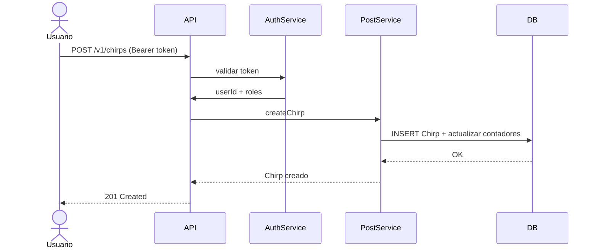
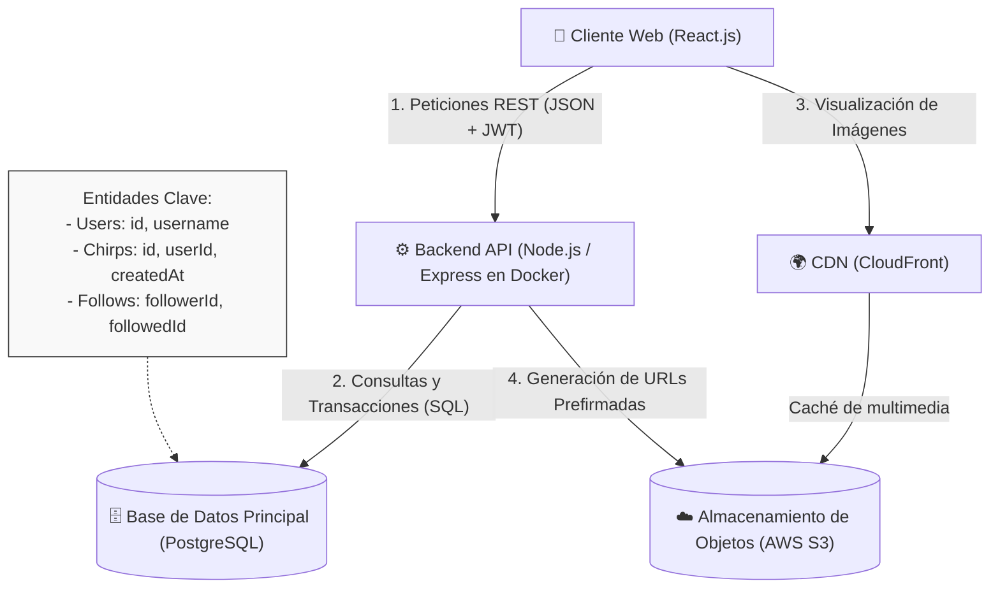
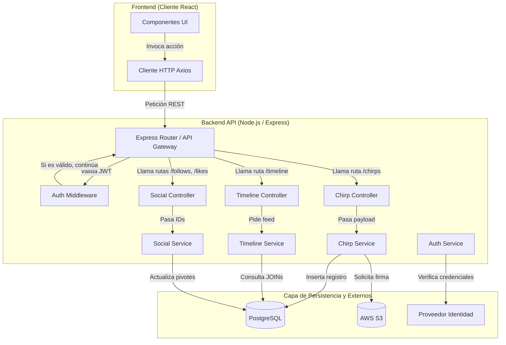
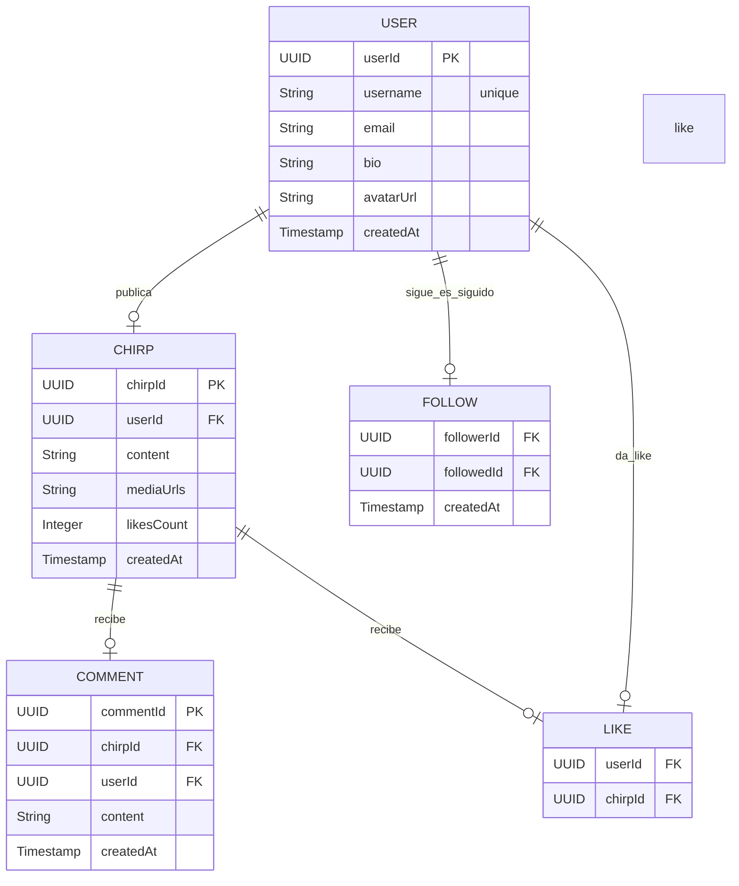

# PROYECTO CHIRP - Diseño Técnico
**ESTADO DEL DOCUMENTO:** EN REVISION
## Resumen
Chirp es una plataforma de microblogging social en tiempo real (similar a X/Twitter). Permite a los usuarios crear chirps (mensajes de máximo 280 caracteres), seguir a otros usuarios, ver un timeline personalizado, dar like y comentar. El objetivo es ofrecer una experiencia de engagement instantáneo con alta disponibilidad y escalabilidad en la nube.
## Supuestos
- Usuarios Activos Diarios (DAU): 500 DAU (escenario objetivo para esta fase).
- Cada usuario realiza en promedio 15–20 acciones por día (lectura de timeline, creación de chirps, likes, comentarios y follows).
- Relación lecturas : escrituras ≈ 40:1 (los usuarios leen mucho más de lo que publican).
- El sistema se ejecutará principalmente en entorno local durante el desarrollo y en AWS Free Tier o instancias pequeñas para pruebas.
- Pico de tráfico simulado: hasta 100 usuarios concurrentes.
- Tamaño promedio de un chirp: 400 bytes (texto) + 150 KB por imagen (solo el 10–15% de los chirps incluyen media).

## Alcance y Limites
Esta primera fase del proyecto Chirp se centra en construir un MVP (Minimum Viable Product) funcional en un entorno de desarrollo y pruebas. El objetivo principal es implementar el núcleo del sistema de microblogging con autenticación completa, cumpliendo con los requisitos funcionales y no funcionales definidos.

alcance de esta fase:

Implementación completa de Autenticación (AuthN) y Autorización (AuthZ) utilizando OIDC/SSO (con Keycloak o Auth0).
CRUD completo de usuarios (registro, perfil público y edición del propio perfil).
Creación, lectura, eliminación de chirps (publicaciones de máximo 280 caracteres, con soporte opcional para imágenes).
Sistema de follows (seguir y dejar de seguir usuarios).
Interacciones básicas con chirps: likes
Despliegue del backend en entorno de desarrollo (local o AWS Free Tier / instancia pequeña).

Limites de esta fase:
Las siguientes funcionalidades quedan explícitamente fuera del alcance de esta entrega (Fase 1), ya que requieren mayor complejidad, tiempo o infraestructura de producción:

Notificaciones en tiempo real (push notifications o WebSockets).
Búsqueda avanzada de chirps o usuarios (full-text search).
Trending topics o recomendaciones algorítmicas.
Sistema de moderación de contenido (reportes, ban de usuarios, IA).
Soporte completo para imágenes/videos (almacenamiento en S3 + CDN).
Reposts / retweets con quote.
Analíticas y métricas de engagement por usuario.
Escalabilidad horizontal real a miles de usuarios concurrentes.
Despliegue en múltiples regiones o alta disponibilidad de producción.
Features de monetización o verificación de cuentas.

Nota importante:
Todas las estimaciones de capacidad, latencia y escalabilidad en este documento se refieren a un entorno de desarrollo y pruebas, simulando hasta 1.000 DAU y 100 usuarios concurrentes. No se pretende alcanzar métricas de producción (99.9% uptime real, millones de usuarios, etc.).

## 1. Requerimientos *(~5 minutos)*

### 1.1 Requerimientos Funcionales

RF1: Creación de Publicaciones (Prioridad Alta)  

Descripción del requerimiento: El núcleo de escritura del sistema. Permite la inserción de nuevos registros de texto corto en la base de datos, reflejándose inmediatamente en el perfil del autor.
Historia de Usuario (HU-01):
Actor: Como usuario autenticado...
Objetivo: ...quiero crear y publicar un chirp de hasta 280 caracteres...
Razón: ...para compartir mis ideas y actualizaciones al instante con mi audiencia.
Criterios de Aceptación:
Los usuarios deben poder ingresar texto en un área de captura.
El sistema debe mostrar un indicador visual que bloquee la publicación si el texto excede los 280 caracteres.
El sistema debe guardar la publicación relacionándola con el usuario y mostrarla de inmediato tras presionar el botón "Publicar".

RF2: Generación del Timeline (Prioridad Alta)
Descripción del requerimiento: El motor de lectura principal. Requiere recolectar y ordenar las publicaciones basándose en el grafo de seguidores del usuario activo para construir su feed principal.
Historia de Usuario (HU-02):
Actor: Como usuario de la plataforma...
Objetivo: ...quiero visualizar un timeline personalizado ordenado cronológicamente...
Razón: ...para mantenerme actualizado de forma centralizada con las publicaciones de las cuentas que sigo.
Criterios de Aceptación:
Los usuarios deben poder acceder a una pantalla principal inmediatamente después de iniciar sesión.
El sistema debe mostrar un flujo continuo de chirps provenientes únicamente de los perfiles a los que el usuario ha dado "Follow".
Los usuarios deben poder hacer scroll hacia abajo para cargar publicaciones más antiguas mediante paginación o scroll infinito sin bloquear la interfaz.

RF3: Interacción Social - Likes (Prioridad Media)
Descripción del requerimiento: Sistema de validación positiva. Registra la interacción única entre un usuario y una publicación, actualizando contadores de forma transaccional.
Historia de Usuario (HU-03):
Actor: Como usuario activo...
Objetivo: ...quiero dar o quitar "Like" a los chirps de la comunidad...
Razón: ...para mostrar aprecio por el contenido de otros y participar en la red.
Criterios de Aceptación:
Los usuarios deben poder hacer clic en un icono de corazón ("Like") para sumar una unidad al contador público de esa publicación.
El sistema debe validar en la base de datos que un usuario no pueda registrar más de un Like en el mismo chirp.
Los usuarios deben poder revertir su "Like" haciendo clic nuevamente (toggle) para disminuir el contador.

### 1.2 Requerimientos No Funcionales

RNF 1: Latencia (Dimensión: Latencia)
Requerimiento: El sistema backend debe generar y entregar la respuesta de lectura del Timeline principal en un tiempo < 400 ms en el percentil 95 (p95) bajo condiciones de tráfico normal.
Contextualización: Para lograr esto sin arquitecturas excesivamente complejas en la fase inicial, se implementará paginación basada en cursores (cargando lotes de 20 chirps) y se evitarán consultas anidadas profundas en la base de datos al momento de cargar el feed.

RNF 2: Escalabilidad de la Infraestructura (Dimensión: Escalabilidad)
Requerimiento: La arquitectura contenerizada debe ser capaz de soportar una base de 10,000 Usuarios Activos Diarios (DAU) y manejar picos de concurrencia de hasta 100 Peticiones Por Segundo (QPS) sin degradación del servicio.
Contextualización: Se asume una proporción de operaciones de lectura/escritura de 10:1. Para cumplir con esto de forma realista, se desplegarán múltiples instancias del contenedor de la API (Node.js/Express) balanceadas, separando las cargas de trabajo de la base de datos relacional y documental.

RNF 3: Disponibilidad y Teorema CAP (Dimensión: CAP / Tolerancia a fallos)
Requerimiento: El sistema debe garantizar un 99.9% de uptime mensual (permitiendo un máximo de ~43 minutos de inactividad al mes) para las funciones críticas: leer el timeline y publicar chirps.
Contextualización: El sistema priorizará la Disponibilidad (A) sobre la Consistencia fuerte (C) del Teorema CAP. Si hay alta carga o falla un proceso asíncrono, se acepta una consistencia eventual donde los contadores secundarios (cantidad total de likes o respuestas) puedan tardar hasta 5 segundos en reflejarse correctamente en todos los clientes.

RNF 4: Restricciones de Seguridad (Dimensión: Seguridad)
Requerimiento: Las APIs públicas del sistema deben aplicar políticas de Rate Limiting que bloqueen las peticiones de escritura si un usuario supera el límite de 30 chirps creados por hora. Además, el 100% de los datos de entrada de texto deben ser sanitizados.
Contextualización: Esto previene ataques de denegación de servicio (DDoS) a nivel de aplicación, controla el spam automatizado (bots) y asegura que no exista inyección de código malicioso (XSS) que afecte el renderizado en el frontend.

### 1.3 Estimación de Capacidad

Las estimaciones de capacidad se realizan considerando un entorno de desarrollo y pruebas, con un universo objetivo de 500 usuarios activos diarios (DAU). Estos cálculos ayudan a dimensionar los recursos necesarios durante el desarrollo y las pruebas simuladas, sin asumir carga de producción.

Cálculos de Tráfico (QPS)
Para 500 DAU:

Escrituras por día:
500 usuarios × 2 acciones de escritura (chirps, likes, comentarios) ≈ 1.000 escrituras/día
→ QPS promedio de escritura ≈ 1.000 / 86.400 ≈ 0,012 QPS
Pico simulado: ≈ 0,05 QPS
Lecturas por día (principalmente carga de timeline):
500 usuarios × 18 lecturas ≈ 9.000 lecturas/día
→ QPS promedio de lectura ≈ 9.000 / 86.400 ≈ 0,104 QPS
Pico simulado durante pruebas: hasta 1 QPS (con 100 usuarios concurrentes).

Almacenamiento Requerido (primer mes)

Chirps de texto: 1.000 chirps/día × 400 bytes ≈ 0,4 MB/día → ≈ 12 MB/mes.
Imágenes/media: 150 imágenes/día × 150 KB ≈ 22,5 MB/día → ≈ 675 MB/mes.
Tablas auxiliares (Users, Follows, Likes, Comments): < 200 MB en el primer mes.
Total estimado primer mes: ≈ 900 MB – 1,1 GB.

Ancho de Banda de Red

Tráfico estimado en pico durante pruebas: < 500 KB/s.
Transferencia de datos mensual total: < 5–8 GB (fácilmente cubierto por el Free Tier de AWS).

Impacto en el Diseño
Estas estimaciones bajas de QPS y almacenamiento confirman que, en un entorno de desarrollo con 500 DAU simulados:

DynamoDB en modo on-demand es más que suficiente y simplifica la gestión.
No se necesita sharding ni configuraciones complejas de escalabilidad.
El principal cuello de botella será la generación del timeline personalizado, por lo que se implementará un caché simple (Redis local o caché en memoria) para mantener buena latencia.
Las pruebas de carga se realizarán simulando 100 usuarios concurrentes con herramientas como Locust o JMeter, para validar que la latencia se mantenga por debajo de 800 ms (p95) en las operaciones críticas (carga de timeline y creación de chirp).

Todas las métricas y pruebas de esta sección corresponden exclusivamente a un entorno controlado de desarrollo y pruebas, no a un despliegue en producción.
## 2. Entidades Principales *(~2 minutos)*

Las entidades principales representan los recursos centrales que el sistema debe gestionar, persistir y exponer a través de la API. Estas entidades se derivan directamente de los requisitos funcionales y forman la base del modelo de datos y del diseño de la API REST con Smithy.
Entidades Principales Identificadas:

User – Representa a los usuarios de la plataforma.
Chirp – Representa las publicaciones (equivalente a un tweet o post).
Follow – Representa la relación de seguimiento entre usuarios.
Like – Representa la interacción de “me gusta” en un chirp.
Comment – Representa los comentarios realizados en un chirp.

A continuación se detalla cada entidad con sus campos principales relevantes para el diseño:

### Tabla: User

| Columna     | Tipo         | Restricciones                           | Descripción                          |
|------------|-------------|----------------------------------------|--------------------------------------|
| userId     | UUID        | PK                                     | Identificador único del usuario      |
| username   | VARCHAR(30) | UNIQUE, NOT NULL, length(3–30)         | Nombre de usuario visible            |
| email      | TEXT        | UNIQUE, NOT NULL                       | Correo electrónico                   |
| displayName| VARCHAR(100)| NOT NULL, length(1–100)                | Nombre mostrado                      |
| bio        | VARCHAR(160)| length(0–160)                          | Biografía del perfil                 |
| avatarUrl  | TEXT        |                                        | URL de la foto de perfil             |
| createdAt  | TIMESTAMP   | DEFAULT CURRENT_TIMESTAMP              | Fecha de creación                    |
| verified   | BOOLEAN     | DEFAULT FALSE                          | Cuenta verificada                    |

### Tabla: Chirp (Twit)

| Columna      | Tipo         | Restricciones                                      | Descripción               |
|-------------|-------------|---------------------------------------------------|---------------------------|
| chirpId     | UUID        | PK                                                | Identificador del chirp   |
| userId      | UUID        | FK → User(userId), INDEX                          | Usuario que publicó       |
| content     | VARCHAR(280)| NOT NULL, length(1–280)                           | Texto del chirp           |
| mediaUrls   | TEXT[]      |                                                   | URLs de imágenes/videos   |
| createdAt   | TIMESTAMP   | DEFAULT CURRENT_TIMESTAMP, SORT KEY               | Fecha de publicación      |
| likesCount  | INTEGER     | DEFAULT 0                                         | Contador de likes         |
| repostsCount| INTEGER     | DEFAULT 0                                         | Contador de reposts       |

### Tabla: Follow

| Columna    | Tipo      | Restricciones                                      | Descripción            |
|-----------|----------|---------------------------------------------------|------------------------|
| followerId| UUID     | PK (compuesta), FK → User(userId)                 | Usuario que sigue      |
| followedId| UUID     | PK (compuesta), FK → User(userId)                 | Usuario seguido        |
| createdAt | TIMESTAMP| DEFAULT CURRENT_TIMESTAMP                         | Fecha del follow       |

### Tabla: Like

| Columna   | Tipo      | Restricciones                                      | Descripción                |
|----------|----------|---------------------------------------------------|----------------------------|
| userId   | UUID     | PK (compuesta), FK → User(userId)                 | Usuario que dio like       |
| chirpId  | UUID     | PK (compuesta), FK → Chirp(chirpId)               | Chirp que recibió like     |
| createdAt| TIMESTAMP| DEFAULT CURRENT_TIMESTAMP                         | Fecha del like             |

---

## 3. API o Interfaz del Sistema *(~5 minutos)*

El sistema expone una API RESTful versionada como protocolo principal de comunicación con los clientes (web y móvil). Se eligió REST por su simplicidad, amplia adopción y facilidad para mapear operaciones CRUD sobre los recursos principales del sistema.

Recurso Users
| Operación         | Método | Endpoint             | Descripción                              | Request Body                             | Response                    | Códigos HTTP posibles |
| ----------------- | ------ | -------------------- | ---------------------------------------- | ---------------------------------------- | --------------------------- | --------------------- |
| Crear usuario     | POST   | /v1/users            | Registro de nuevo usuario                | `{ username, email, displayName, bio? }` | `{ userId, username, ... }` | 201, 400, 409         |
| Obtener perfil    | GET    | /v1/users/{username} | Obtener información pública de un perfil | -                                        | User Profile                | 200, 404              |
| Actualizar perfil | PUT    | /v1/users/me         | Actualizar datos del usuario autenticado | `{ displayName, bio, avatarUrl? }`       | User Profile actualizado    | 200, 400, 401         |

Recurso Chirp
| Operación                      | Método | Endpoint             | Descripción                             | Request Body               | Response                         | Códigos HTTP posibles |
| ------------------------------ | ------ | -------------------- | --------------------------------------- | -------------------------- | -------------------------------- | --------------------- |
| Crear chirp                    | POST   | /v1/chirps           | Publicar un nuevo chirp                 | `{ content, mediaUrls? }`  | `{ chirpId, ... }`               | 201, 400, 401         |
| Obtener chirp                  | GET    | /v1/chirps/{chirpId} | Obtener un chirp específico             | -                          | Chirp detallado                  | 200, 404              |
| Eliminar chirp                 | DELETE | /v1/chirps/{chirpId} | Eliminar chirp propio                   | -                          | -                                | 204, 403, 404         |
| Obtener timeline personalizado | GET    | /v1/timeline         | Timeline de chirps de usuarios seguidos | `?limit=20&before=chirpId` | `{ chirps: [...], nextCursor? }` | 200, 401              |

Recurso Like
| Operación   | Método | Endpoint                  | Descripción             | Request Body | Response | Códigos HTTP posibles |
| ----------- | ------ | ------------------------- | ----------------------- | ------------ | -------- | --------------------- |
| Dar like    | POST   | /v1/chirps/{chirpId}/like | Dar like a un chirp     | -            | -        | 201, 400, 404         |
| Quitar like | DELETE | /v1/chirps/{chirpId}/like | Quitar like de un chirp | -            | -        | 204, 404              |

Recurso Follow
| Operación       | Método | Endpoint                 | Descripción                  | Request Body     | Response | Códigos HTTP posibles |
| --------------- | ------ | ------------------------ | ---------------------------- | ---------------- | -------- | --------------------- |
| Seguir usuario  | POST   | /v1/follows              | Seguir a otro usuario        | `{ followedId }` | -        | 201, 400, 404         |
| Dejar de seguir | DELETE | /v1/follows/{followedId} | Dejar de seguir a un usuario | -                | -        | 204, 404              |

---

## 4. Flujo de Datos *(~5 minutos)* [Opcional]

Fuente del Diagrama

---

## 5. Diseño de Alto Nivel *(~10-15 minutos)*

#### Flujo de Datos por Endpoint (Satisfaciendo los Requerimientos)
La arquitectura dibujada arriba resuelve nuestros tres requerimientos funcionales principales de la siguiente manera:
Flujo para Crear un Chirp (POST /api/chirps):
El Cliente Web envía el texto del chirp y el token de autenticación (JWT) al Backend API.
La API valida la identidad del usuario y guarda el contenido en la tabla Chirps de la Base de Datos (PostgreSQL).
Si el usuario incluye una imagen: La API solicita una URL prefirmada a AWS S3 y se la devuelve al cliente. El cliente sube la imagen directamente a S3, y la URL final se asocia al chirp en la base de datos.
Flujo para Generar el Timeline (GET /api/timeline):
El Cliente Web solicita su feed principal.
La API ejecuta una consulta en la Base de Datos, uniendo (JOIN) la tabla Follows (para saber a quién sigue el usuario) con la tabla Chirps, filtrando por los más recientes y aplicando paginación.
Si los chirps incluyen imágenes, el cliente las descarga rápidamente a través de la CDN, reduciendo la carga en nuestro servidor principal.
Flujo para Dar Like (POST /api/chirps/:id/like):
El Cliente Web envía la petición al hacer clic en el botón.
La API inserta un registro en la tabla pivote Likes dentro de la Base de Datos (vinculando el userId y el chirpId) y actualiza el contador.
#### Entorno de Ejecución e Infraestructura
Para garantizar que el sistema cumpla con las métricas de rendimiento y escalabilidad (10,000 DAU y 100 QPS) sin sobrecomplicar la operación inicial, la infraestructura se gestionará de la siguiente manera:
Aprovisionamiento y Despliegue: Se aprovisionará infraestructura nueva en la nube (AWS). El Backend API no se ejecutará en servidores tradicionales, sino que estará contenerizado usando Docker. Esto permitirá levantar múltiples instancias de la aplicación de forma idéntica y predecible.
Base de Datos: Se utilizará un servicio gestionado para la base de datos relacional (como Amazon RDS para PostgreSQL), delegando la responsabilidad de los respaldos automatizados, la seguridad en reposo y el mantenimiento del hardware al proveedor de la nube.
Canalizaciones (CI/CD): Se implementarán nuevas canalizaciones de integración y entrega continua utilizando GitHub Actions. Al integrar nuevo código a la rama principal, el flujo ejecutará las pruebas automatizadas, construirá la nueva imagen de Docker y la desplegará en el entorno de producción, garantizando actualizaciones ágiles y con mínima intervención manual.

### Componentes
El sistema Chirp está compuesto por los siguientes componentes principales que interactúan entre sí para cumplir los requisitos funcionales y no funcionales definidos. Todos los componentes están diseñados para funcionar en un entorno de desarrollo (local + AWS Free Tier).
## 1. Componentes Principales

## API Layer (Frontend + API Gateway)
Punto de entrada del sistema. Recibe todas las solicitudes HTTP de los clientes (web o móvil). Se encarga de la autenticación inicial y enruta las peticiones al Backend Service.
## Backend Service
Servicio principal de la aplicación (implementado en Java/Spring Boot o similar). Contiene toda la lógica de negocio: validación de chirps, manejo de follows, likes, comentarios y generación del timeline. Extrae el userId del JWT y aplica reglas de autorización.
## Authentication Service (OIDC Provider)
Proveedor de identidad externo (Keycloak self-hosted o Auth0). Maneja login, registro, emisión y validación de tokens JWT (Access Token + Refresh Token).
## Database Layer (Amazon DynamoDB)
Almacenamiento persistente principal. Utiliza Single Table Design con índices secundarios para soportar consultas eficientes de usuarios, chirps y relaciones.
## Cache Layer (Redis)
Almacena timelines recientes de usuarios para reducir latencia en la operación más crítica (carga del timeline personalizado). En desarrollo se puede usar Redis local o Docker.
Storage Layer (Amazon S3)
Almacenamiento de archivos multimedia (imágenes/videos) adjuntos a los chirps. Solo se guarda la URL en DynamoDB.

2. Interacciones entre Componentes
El flujo típico de una solicitud es el siguiente:

El cliente envía una petición HTTP al API Layer con el token JWT en el header Authorization: Bearer <token>.
El API Layer valida el token con el Authentication Service.
La solicitud se reenvía al Backend Service.
El Backend Service:
Extrae el userId del token.
Consulta/escribe en DynamoDB.
Consulta Redis cuando se necesita leer el timeline.
Sube archivos a S3 si el chirp incluye media.

La respuesta se devuelve al cliente a través del API Layer.

## 6. Inmersiones Profundas *(~10 minutos)*

Esta sección profundiza en aspectos clave del diseño para garantizar que se cumplan los requisitos funcionales y no funcionales en un entorno de desarrollo y pruebas.

### 6.1 Esquema de Base de Datos

Se utilizará Amazon DynamoDB (modo on-demand) como base de datos principal por su escalabilidad automática, alta disponibilidad y bajo costo en entornos de desarrollo. El esquema está diseñado para soportar patrones de acceso comunes en redes sociales (lecturas de timeline y escrituras dispersas).

#Tabla User
| Columna     | Tipo    | Restricciones       | Descripción                |
| ----------- | ------- | ------------------- | -------------------------- |
| userId      | String  | PK                  | Identificador único (UUID) |
| username    | String  | Unique, GSI         | Nombre de usuario único    |
| email       | String  | Unique              | Correo electrónico         |
| displayName | String  | -                   | Nombre mostrado            |
| bio         | String  | Máx. 160 caracteres | Biografía del perfil       |
| avatarUrl   | String  | -                   | URL de la foto de perfil   |
| verified    | Boolean | Default: false      | Cuenta verificada          |
| createdAt   | String  | -                   | Fecha de creación (ISO)    |

#Tabla Chirp
| Columna       | Tipo   | Restricciones       | Descripción                              |
| ------------- | ------ | ------------------- | ---------------------------------------- |
| chirpId       | String | PK                  | Identificador único del chirp            |
| userId        | String | GSI                 | Usuario que publicó                      |
| content       | String | Máx. 280 caracteres | Texto del chirp                          |
| mediaUrls     | List   | Opcional            | Lista de URLs de imágenes                |
| createdAt     | String | Sort Key            | Fecha de publicación (orden cronológico) |
| likesCount    | Number | Default: 0          | Contador de likes                        |
| repostsCount  | Number | Default: 0          | Contador de reposts                      |
| parentChirpId | String | Opcional            | Para respuestas/comentarios en hilo      |

#Tabla Follow
| Columna    | Tipo   | Restricciones  | Descripción       |
| ---------- | ------ | -------------- | ----------------- |
| followerId | String | PK (compuesta) | Usuario que sigue |
| followedId | String | PK (compuesta) | Usuario seguido   |
| createdAt  | String | -              | Fecha del follow  |

#Tabla Like
| Columna   | Tipo   | Restricciones  | Descripción            |
| --------- | ------ | -------------- | ---------------------- |
| userId    | String | PK (compuesta) | Usuario que dio like   |
| chirpId   | String | PK (compuesta) | Chirp que recibió like |
| createdAt | String | -              | Fecha del like         |

# Diagrama ER (Estructura de la base de datos)

Este es un diagrama ER que muestra la estructura de la base de datos para una aplicación de redes sociales:

### 6.2 Escalabilidad e Infraestructura

En entorno de desarrollo con 500 DAU simulados, el sistema utiliza servicios gestionados de AWS que escalan automáticamente:

DynamoDB on-demand: Escala automáticamente según el tráfico real sin necesidad de aprovisionar capacidad.
API Gateway + Lambda (o aplicación Spring Boot/EC2 pequeña): Maneja las solicitudes HTTP.
Caché: Redis (Elasticache o Redis local en desarrollo) para cachear timelines frecuentes y reducir lecturas en DynamoDB.
Almacenamiento de imágenes: Amazon S3 (para mediaUrls).

Costo estimado mensual (entorno de desarrollo):

DynamoDB: < $5 USD/mes (con ~1 GB de almacenamiento y bajo QPS).
S3: < $1 USD/mes.
API Gateway + Lambda: < $2 USD/mes con bajo tráfico.
Total estimado: $5 – 10 USD/mes (dentro del Free Tier en la mayoría de los casos).

El tráfico de red esperado es muy bajo (< 500 KB/s en pico), por lo que no representa un límite.

### 6.4 Seguridad

Autenticación mediante OIDC + Authorization Code Flow con PKCE usando Keycloak (self-hosted) o Auth0.
Todos los endpoints protegidos con @httpBearerAuth en Smithy.
El userId siempre se extrae del JWT (sub claim), nunca del body.
Validación de entradas: longitud máxima, escaping de HTML y patrones regex donde corresponda.
Prevención de ataques comunes: rate limiting básico en API Gateway y validación estricta para evitar inyección.

No se realizarán pruebas de penetración formales en esta fase, pero se aplicarán buenas prácticas de seguridad OWASP.

### 6.5 Extensibilidad

En tres años, el sistema debería poder escalar desde 500 DAU simulados hasta varios miles de usuarios reales.
Lo que se soportará en el futuro:

Búsqueda full-text de chirps (usando Elasticsearch o DynamoDB + OpenSearch).
Notificaciones en tiempo real mediante WebSockets o Server-Sent Events.
Sistema de recomendaciones básico.
Soporte completo para multimedia con CDN.

Lo que nunca se soportará en esta arquitectura:

Funcionalidades de mensajería privada (requeriría un diseño completamente diferente de Chat).

### 6.10 Metodología de Pruebas
Pruebas que se realizarán:

Pruebas unitarias: Cobertura > 70% en lógica de negocio (creación de chirp, validaciones, etc.).
Pruebas de integración: Pruebas automatizadas con Postman o scripts que validen flujos completos (login → crear chirp → seguir usuario → ver timeline).
Pruebas manuales: Verificación de flujos de usuario finales.
Pruebas de carga: Simulación de hasta 100 usuarios concurrentes con Locust, midiendo latencia del timeline y creación de chirps.
Pruebas de seguridad: Verificación de acceso no autorizado y validación de tokens.

Las pruebas de integración se ejecutarán en la pipeline de CI/CD (GitHub Actions) antes de cualquier merge a main

### 6.11 Dependencias

### 6.12 Operaciones

## Temas de Discusión

###Tema de Discusión 1: Elección de Base de Datos para Entorno de Desarrollo
Problema:
Necesitamos una base de datos que soporte relaciones (follows, likes, comments) y lecturas frecuentes de timeline, pero que sea fácil de usar y de bajo costo en un entorno académico.

Opción 1 [RECOMENDADA] — Amazon DynamoDB (modo on-demand)
Opción 2 — PostgreSQL (relacional)
Opción 3 — MongoDB

Opción 1 [RECOMENDADA] — Amazon DynamoDB (modo on-demand)
Se utilizará DynamoDB con Single Table Design + Global Secondary Indexes para las consultas más comunes.
Pros:

Escala automáticamente sin necesidad de aprovisionar capacidad.
Muy bajo costo en Free Tier para 500 DAU.
Excelente rendimiento en lecturas y escrituras dispersas.
Fácil de configurar en entorno de desarrollo.

Contras:

Requiere diseño cuidadoso de claves de partición y índices (Single Table Design).
Las consultas complejas (joins) deben resolverse en aplicación.

Opción 2 — PostgreSQL
Pros: Joins nativos fáciles.
Contras: Requiere gestión de servidor, escalado más complejo y mayor costo operativo en desarrollo.
Conclusión
Se elige DynamoDB porque se alinea mejor con los requisitos no funcionales de escalabilidad automática y bajo mantenimiento en un entorno académico.

## Contactos

Líder Técnico / Autor — Jose Daza
Gerente de Producto (PM) — Jorge
Gerente de Ingeniería (SDM) — Javier
Desarrolladores principales — Moisés y Mauricio

## Apéndice

### Apéndice A - Antecedentes

### Apéndice B - Actas de Revisión

*Capturar las actas de las reuniones de revisión es una buena manera de registrar las decisiones acordadas y ganar la confianza de sus revisores.*

*Las actas deben incluir:*

- Fecha de revisión
- Asistentes - Si no registró todas las personas específicas, al menos describa qué equipos estuvieron representados
- Comentarios / Preguntas Respondidas
- Elementos de Acción con Responsables

Ejemplo:

**Revisión (30/06/2020):**

**Asistentes:**

- Equipo de Ingeniería de Datos
- Equipo de Operaciones de Seguridad

**Comentarios:**

• Todos los asistentes están de acuerdo con la opción técnica 1.
• X tiene una preocupación de que Y; nos aseguraremos de Z.

Acciones:
• nombre@: Cambiar los desgloses de trabajo basados en el alcance del proyecto recién actualizado.

*--- FIN DE LA SECCIÓN A ELIMINAR ---*
